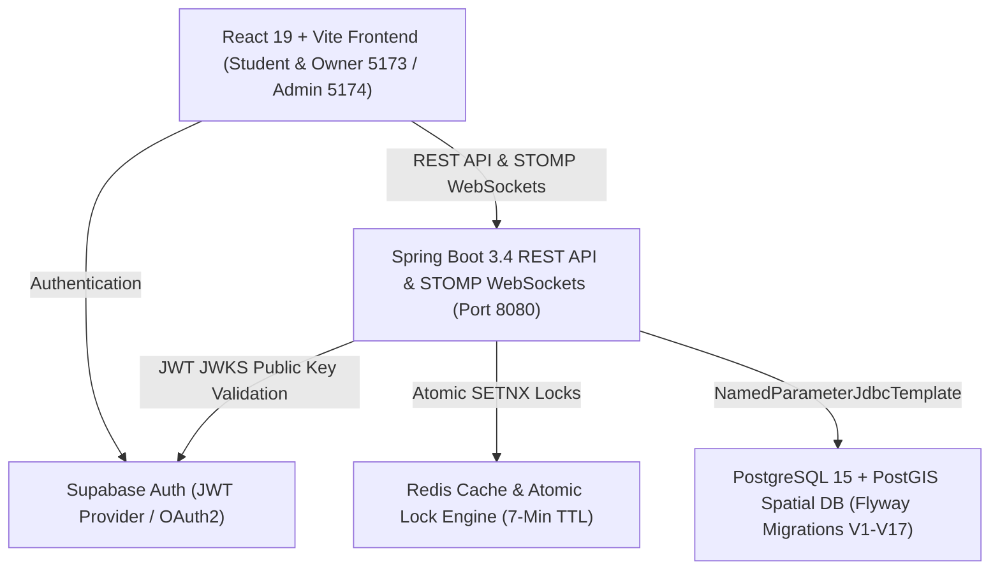

## EduGlobin — Module-Wise System Architecture, System Design & Role-Based Flow Directory

This document details the entire EduGlobin codebase organized **strictly by functional module** as specified in the Product Requirement Documents (PRD Core, PRD Addendum v2.5, and PRD Addendum v2.6).

Every file is categorized under its respective domain module, with a detailed technical explanation outlining its specific purpose, input/output data, core functions, and cross-module interactions.

---

## Index of Modules & System Flows

*   [System Design & Role-Based User Flows (Student, Owner, Admin)](#system-design--role-based-user-flows)
*   [Module 1: Authentication, Authorization & Identity](#module-1-authentication-authorization--identity)
*   [Module 2: Indian Administrative Hierarchy (LGD) & Geospatial Search](#module-2-indian-administrative-hierarchy-lgd--geospatial-search)
*   [Module 3: Live Seat Map, Concurrency Locks & WebSocket Engine](#module-3-live-seat-map-concurrency-locks--websocket-engine)
*   [Module 4: Student Booking Checkout & Reservation Lifecycle](#module-4-student-booking-checkout--reservation-lifecycle)
*   [Module 9: Library Onboarding, Layout Provisioning & Admin Approval](#module-9-library-onboarding-layout-provisioning--admin-approval)
*   [Module 10: Locker Ecosystem & Check-In Validation](#module-10-locker-ecosystem--check-in-validation)
*   [Module 11: Walk-In Students, Counter Cash/UPI & Session Top-Ups](#module-11-walk-in-students-counter-cashupi--session-top-ups)
*   [Module 13: Free Libraries & Zero-Cost Checkouts](#module-13-free-libraries--zero-cost-checkouts)
*   [Module 14: Simplified Seat Creation & Automated Layout Synthesis](#module-14-simplified-seat-creation--automated-layout-synthesis)
*   [Module 16: Customer Support & Platform Escalation Channel](#module-16-customer-support--platform-escalation-channel)
*   [Module 17: Price-Change Governance & Configurable Thresholds](#module-17-price-change-governance--configurable-thresholds)
*   [Module 18: Temporary Ticket & Owner Confirmation Window](#module-18-temporary-ticket--owner-confirmation-window)
*   [Module 19: Cancellation Engine, Tiered Refunds, Disputes & Student Wallets](#module-19-cancellation-engine-tiered-refunds-disputes--student-wallets)
*   [Module 20: Privacy-Compliant Owner Views & Data Masking](#module-20-privacy-compliant-owner-views--data-masking)
*   [Module 21: Institute Vacate & Cancellation Integrity Model (Modules 36–40 Specification)](#module-21-institute-vacate--cancellation-integrity-model-modules-3640-specification)
*   [Module 26: Two Booking Models, by Category (Institute Flexible Slot vs Govt/Private Fixed Shift)](#module-26-two-booking-models-by-category-institute-flexible-slot-vs-govtprivate-fixed-shift)
*   [Module 27: Institute Flexible Slot Rules & Interval Overlap Engine](#module-27-institute-flexible-slot-rules--interval-overlap-engine)
*   [Module 28: Proactive "Opening Soon" Recommendations](#module-28-proactive-opening-soon-recommendations)
*   [Module 29: FIFO Seat Queue System & 2-Minute Time-Boxed Claim Window](#module-29-fifo-seat-queue-system--2-minute-time-boxed-claim-window)
*   [Module 30: Queue-Gated Same-Seat Top-Up (Fairness Rule)](#module-30-queue-gated-same-seat-top-up-fairness-rule)
*   [Module 31: Standalone Book Circulation Desk](#module-31-standalone-book-circulation-desk)
*   [Module 32: Physical Book Catalog Schema](#module-32-physical-book-catalog-schema)
*   [Module 33: Counter Book Issue & Reissue Extensions](#module-33-counter-book-issue--reissue-extensions)
*   [Module 34: Counter Return & Automated Overdue Sweeps](#module-34-counter-return--automated-overdue-sweeps)
*   [Module 35: Student Library Profile Soft-Deactivation](#module-35-student-library-profile-soft-deactivation)
*   [Module 36: Visiting Circulation Students (Issue/Reissue/Return), 40-Min Limit & Exit Approval](#module-36-visiting-circulation-students-issuereissuereturn-40-min-time-limit--exit-approval)
*   [Module 41: Institute Single Active Seat Rule](#module-41-institute-single-active-seat-rule)
*   [Module 42: Blocked Top-Up Redirection Engine](#module-42-blocked-top-up-redirection-engine)
*   [PRD Placeholders: CRM, Complaints & Gamification](#prd-placeholders-crm-complaints--gamification)
*   [Foundational Infrastructure, Theme & Internationalization](#foundational-infrastructure-theme--internationalization)

---

## System Design & Role-Based User Flows

### System Architecture Overview


---

### Role 1: Student User Flow
```
┌─────────────────────────────────────────────────────────────────────────────┐
│ 1. Search & Discovery                                                       │
│    • Filter libraries by Tehsil/LGD, district, spatial radius, shift, category│
├─────────────────────────────────────────────────────────────────────────────┤
│ 2. Seat Selection & Availability Check                                      │
│    • Govt/Private: Select fixed shift (Morning/Afternoon/Evening/Night)     │
│    • Institute: Select flexible start time & duration (30 mins to 4 hours)  │
│    • 0 Seats Available? View "Opening Soon" countdowns or Join FIFO Queue   │
├─────────────────────────────────────────────────────────────────────────────┤
│ 3. Atomic Lock & Checkout                                                   │
│    • 7-Minute Redis atomic lock reservation                                 │
│    • Institute Single Active Seat Rule check (Module 41)                    │
│    • Flexible slot interval check & daily usage cap check (Module 27)       │
│    • Complete checkout (Free pass or UPI/Payment) → Booking BOOKED/IN_USE   │
├─────────────────────────────────────────────────────────────────────────────┤
│ 4. Gate Check-In & Attendance                                               │
│    • Present HMAC-SHA256 QR code or 6-character booking reference           │
│    • Gate scanner validates token and updates status to IN_USE              │
├─────────────────────────────────────────────────────────────────────────────┤
│ 5. Session Extension (Top-Up) or Self-Vacate                                │
│    • Prompt "Extend session" → Queue Check (Module 30)                      │
│      - Queue Empty: Extend valid_until seamlessly                           │
│      - Queue Held: Revoke top-up, redirect to alternatives (Module 42)    │
│    • Unilateral Self-Vacate (Module 14) → Seat freed to AVAILABLE           │
├─────────────────────────────────────────────────────────────────────────────┤
│ 6. Physical Book Borrowing & Visiting Desk (Modules 31–36)                  │
│    • View active book loans, due date badges, and overdue alerts            │
│    • Visitor Check-In: View 40-min limit timer, tap "Request Exit" button   │
└─────────────────────────────────────────────────────────────────────────────┘
```

---

### Role 2: Library Owner / Desk Staff User Flow
```
┌─────────────────────────────────────────────────────────────────────────────┐
│ 1. 4-Tab Desk Interface (Institute Category Libraries)                      │
│    • Tab 1: Interactive Seat Layout & Dashboard                             │
│    • Tab 2: Standalone Book Circulation Desk                                │
│    • Tab 3: Gate QR Camera Scanner & Passcode Validator                     │
│    • Tab 4: Walk-In Counter Cash / Dynamic UPI QR Generator                 │
├─────────────────────────────────────────────────────────────────────────────┤
│ 2. Flexible Slot Rule Administration (Module 27)                            │
│    • Configure min/max booking duration, student daily usage cap, turnover   │
│      buffer, and operating hours boundary (e.g., 08:00 - 20:00)             │
├─────────────────────────────────────────────────────────────────────────────┤
│ 3. Real-Time Seat Monitoring (Modules 3, 4, 14, 20)                         │
│    • STOMP WebSocket live updates: Green (Available), Red (In Use),         │
│      Violet (Booked/Waiting), Pink (Girls Reserved), Amber (Sofa Lounge)    │
│    • Privacy-compliant data masking (Student Name, Roll No., Branch)        │
├─────────────────────────────────────────────────────────────────────────────┤
│ 4. Book Circulation & Visitor Management (Modules 31–36)                    │
│    • Search student profiles by Institute ID Number or Phone                │
│    • Issue, reissue, and return physical catalog books                      │
│    • Visitor Check-In: Register visiting students (40-min limit active)     │
│    • 40-Min Overtime Alert: Red banner & pop-up alert when visitor > 40 mins│
│    • 1-Click Direct Counter Exit or Approve Student Exit Request            │
└─────────────────────────────────────────────────────────────────────────────┘
```

---

### Role 3: Super Admin Portal Flow (Port 5174)
```
┌─────────────────────────────────────────────────────────────────────────────┐
│ 1. Tehsil & LGD Location Onboarding                                         │
│    • Onboard and manage India LGD State, District, and Sub-District/Tehsil  │
├─────────────────────────────────────────────────────────────────────────────┤
│ 2. Commercial Fee Ledgers & Financial Reconciliations                      │
│    • Track partner library onboarding approval queue                        │
│    • Audit coin transactions, seat commissions, and wallet ledgers          │
├─────────────────────────────────────────────────────────────────────────────┤
│ 3. Dispute Escalation & System Diagnostics                                  │
│    • Review student/owner support tickets and immutable audit logs          │
│    • 1-Click automated database reset & auto-seeding runner (`reset_db_auto`)│
└─────────────────────────────────────────────────────────────────────────────┘
```

---

## Module 1: Authentication, Authorization & Identity

This module governs user authentication, JWT cryptographic verification, role-based access control (RBAC), and automatic database synchronization across Supabase Auth and the application's PostgreSQL database.

### Backend Components
*   **[`SecurityConfig.java`](file:///e:/EduGlobin/backend/src/main/java/com/eduglobin/config/SecurityConfig.java)**
    *   Configures Spring Security 6 as a stateless OAuth2 Resource Server validating HMAC-SHA256 JWT tokens issued by Supabase Auth.
    *   Extracts user role claims (`STUDENT`, `LIBRARY_OWNER`, `STAFF`, `SUPER_ADMIN`) and maps them directly into Spring `GrantedAuthority` collections.
    *   Declares route authorization rules: public endpoints (actuators, search queries, location lookups) vs. authenticated mutations (locking, checkout, profile updates).
    *   Disables CSRF, sets session creation to stateless, and registers global CORS origins allowing requests from the frontend Vite server.
*   **[`AdminSeedRunner.java`](file:///e:/EduGlobin/backend/src/main/java/com/eduglobin/auth/AdminSeedRunner.java)**
    *   A startup `CommandLineRunner` active under non-test profiles (`@Profile("!test")`) to guarantee administrative access on newly deployed environments.
    *   Directly communicates with the Supabase Admin API using service-role credentials to check for the master admin account (`admin@eduglobin.com`).
    *   If absent, provisions the account with a preconfigured secure password and creates the corresponding row in `profiles` with role `SUPER_ADMIN`.
    *   Handles duplicate key conflicts gracefully to ensure non-blocking, idempotent application restarts.
*   **[`UserPrincipal.java`](file:///e:/EduGlobin/backend/src/main/java/com/eduglobin/common/UserPrincipal.java)**
    *   An immutable value object extracting authenticated caller details from Spring Security's active `SecurityContextHolder`.
    *   Provides typed convenience accessors for user UUID, email address, role name, and assigned library identifier (for library staff).
    *   Eliminates repetitive JWT claim parsing across controller endpoints and ensures type-safe identity resolution.
    *   Acts as the unified caller context passed into transactional service methods.
*   **[`MeController.java`](file:///e:/EduGlobin/backend/src/main/java/com/eduglobin/common/MeController.java)**
    *   REST controller exposing `GET /api/v1/me` for post-login profile synchronization.
    *   Retrieves the caller's database profile row from PostgreSQL, returning full name, verified role, preferred UI theme, and language.
    *   Returns HTTP 401 Unauthorized if the client token is invalid or expired, allowing frontend routers to immediately redirect to login.
    *   Serves as the foundational validation check preventing unauthorized cross-role access (e.g., student accessing owner portals).

### Frontend Components
*   **[`LoginPage.tsx`](file:///e:/EduGlobin/frontend/src/pages/LoginPage.tsx)**
    *   The primary authentication portal offering role-specific sign-in tabs ("Student / Aspirant" and "Library Owner / Manager").
    *   Supports traditional email/password credentials and direct single-click Google OAuth redirection via Supabase Auth.
    *   Features the centered EduGlobin logo ([`logov1.png`](file:///e:/EduGlobin/frontend/public/logov1.png)) with two-tone styling and integrated theme/language switchers.
    *   Performs client-side validation and renders contextual error alerts for incorrect passwords or unconfirmed accounts.
*   **[`AuthCallbackPage.tsx`](file:///e:/EduGlobin/frontend/src/pages/AuthCallbackPage.tsx)**
    *   OAuth callback receiver intercepting tokens and URL fragments returned by Supabase after third-party OAuth flows.
    *   Calls the backend `/api/v1/me` endpoint to verify if the authenticating user already has a provisioned database profile.
    *   Routes existing users to their respective dashboards (Student Search vs. Owner Console) or redirects new users to role selection.
    *   Handles token storage in browser `localStorage` and cleans up OAuth query parameters from the browser address bar.
*   **[`RoleSelectPage.tsx`](file:///e:/EduGlobin/frontend/src/pages/RoleSelectPage.tsx)** & **[`RegisterRolePage.tsx`](file:///e:/EduGlobin/frontend/src/pages/RegisterRolePage.tsx)**
    *   Presents interactive onboarding cards allowing newly registered OAuth users to select their account role.
    *   Collects supplementary onboarding metadata (target exams and academic year for students; commercial license and contact data for owners).
    *   Commits the profile updates to PostgreSQL, transitioning the user from pending state into active platform access.

### Database Schema
*   **[`V1__init_schema.sql`](file:///e:/EduGlobin/backend/src/main/resources/db/migration/V1__init_schema.sql)**: Establishes `profiles` table linked by foreign key to Supabase's `auth.users(id)` with check constraints on `role` and `auth_provider`.

---

## Module 2: Indian Administrative Hierarchy (LGD) & Geospatial Search

This module implements comprehensive location resolution based on the Indian Local Government Directory (LGD), PostGIS spatial proximity calculations, lazy on-demand geocoding, and a 4-factor scoring algorithm.

### Backend Components
*   **[`LgdSeedRunner.java`](file:///e:/EduGlobin/backend/src/main/java/com/eduglobin/library/LgdSeedRunner.java)**
    *   Startup runner parsing [`lgd_data.csv`](file:///e:/EduGlobin/backend/src/main/resources/seed-data/lgd_data.csv) to bulk-insert Indian administrative boundaries into `india_admin_hierarchy`.
    *   Executes high-performance batch updates using `NamedParameterJdbcTemplate` to seed states, districts, tehsils, and villages in one pass.
    *   Explicitly marks recognized student hubs (Indore, Kota, Sikar, Delhi) with `is_featured_hub = TRUE` for prominent search ranking.
    *   Ensures that local development instances have complete location records without needing external network connectivity.
*   **[`TehsilGeocodeRunner.java`](file:///e:/EduGlobin/backend/src/main/java/com/eduglobin/library/TehsilGeocodeRunner.java)**
    *   Resolves geographic coordinate anchors (latitude and longitude) for distinct tehsils across India.
    *   Maintains a built-in static coordinate registry covering major districts and tehsils to operate reliably in offline mode.
    *   If a Google Geocoding API key is configured, queries Google APIs for unanchored tehsils and caches the coordinates in the database.
    *   Applies a deterministic regional offset fallback algorithm to prevent null coordinate values from breaking spatial distance formulas.
*   **[`OnDemandVillageGeocodeService.java`](file:///e:/EduGlobin/backend/src/main/java/com/eduglobin/library/search/OnDemandVillageGeocodeService.java)**
    *   Implements lazy geocoding refinement to conserve third-party API quotas by geocoding village locations only when searched by a user.
    *   Detects when a selected village row is sharing its parent tehsil's default center coordinates.
    *   Calls the Google Geocoding API asynchronously to upgrade the village row with precise street-level coordinates.
    *   If external APIs are unavailable, applies a stable jitter offset around the tehsil center as a graceful fallback.
*   **[`LibrarySearchRepository.java`](file:///e:/EduGlobin/backend/src/main/java/com/eduglobin/library/search/LibrarySearchRepository.java)**
    *   Spring Data JDBC repository executing PostGIS spatial queries against the PostgreSQL database.
    *   Uses PostGIS functions `ST_DWithin` and `ST_Distance` on `libraries.geo_point` (GIST indexed) to find libraries within a specified radius.
    *   Applies secondary SQL filter clauses for amenities arrays (GIN indexed), focused exams arrays, and monthly price boundaries.
    *   Maps relational result sets into lightweight `LibraryCandidate` records for downstream scoring.
*   **[`LibraryScoringService.java`](file:///e:/EduGlobin/backend/src/main/java/com/eduglobin/library/search/LibraryScoringService.java)**
    *   Executes a deterministic multi-attribute scoring formula to calculate match percentages between 0% and 100%.
    *   Weighs four distinct dimensions: physical distance fit (40%), budget compatibility (25%), exam focus alignment (20%), and amenities match (15%).
    *   Returns a neutral baseline coefficient of 0.5 for missing preferences so unstated criteria do not skew rankings unfairly.
    *   Provides human-readable match highlight tags (e.g., "Within 1.5 km", "Matches UPSC prep", "AC available") for frontend cards.
*   **[`LibrarySearchService.java`](file:///e:/EduGlobin/backend/src/main/java/com/eduglobin/library/search/LibrarySearchService.java)** & **[`LibrarySearchController.java`](file:///e:/EduGlobin/backend/src/main/java/com/eduglobin/library/search/LibrarySearchController.java)**
    *   Controller and orchestration service exposing `GET /api/v1/libraries/search`.
    *   Binds HTTP query parameters into `SearchCriteria` objects and coordinates candidate retrieval and scoring.
    *   Sorts results according to user request (match score, physical distance, lowest price, highest rating) and returns `ScoredLibraryDto` lists.
*   **[`LocationController.java`](file:///e:/EduGlobin/backend/src/main/java/com/eduglobin/library/search/LocationController.java)** & **[`LocationResult.java`](file:///e:/EduGlobin/backend/src/main/java/com/eduglobin/library/search/LocationResult.java)**
    *   Exposes `GET /api/v1/locations/search` using PostgreSQL full-text search vectors (`to_tsvector`) across administrative names.
    *   Returns autocomplete location suggestions tagged with coordinate precision indicators (`VILLAGE` or `TEHSIL`).

### Frontend Components
*   **[`LocationPicker.tsx`](file:///e:/EduGlobin/frontend/src/components/LocationPicker.tsx)**: Debounced autocomplete input component fetching LGD suggestions and firing coordinate selection callbacks.
*   **[`SearchPage.tsx`](file:///e:/EduGlobin/frontend/src/pages/SearchPage.tsx)**: Manual filter search page with budget sliders, amenity toggles, exam pills, and responsive library result cards.
*   **[`RecommendPage.tsx`](file:///e:/EduGlobin/frontend/src/pages/RecommendPage.tsx)**: Multi-step "AI Solver" wizard matching student study habits against libraries using weighted scoring.
*   **[`LibraryMap.tsx`](file:///e:/EduGlobin/frontend/src/components/LibraryMap.tsx)**: Visual map component plotting library pins with distance overlays and quick-booking modals.

### Automated Tests
*   **[`LibraryScoringServiceTest.java`](file:///e:/EduGlobin/backend/src/test/java/com/eduglobin/library/LibraryScoringServiceTest.java)**: Validates weighted formula calculations, neutral score fallbacks, and tag generation across varied candidate libraries.

---

## Module 3: Live Seat Map, Concurrency Locks & WebSocket Engine

This module provides high-concurrency seat locking, real-time status broadcasting via STOMP WebSockets, automated lock reconciliation, and an interactive frontend seat grid.

### Backend Components
*   **[`ResourceLockService.java`](file:///e:/EduGlobin/backend/src/main/java/com/eduglobin/booking/ResourceLockService.java)**
    *   The core distributed concurrency engine utilizing Redis via Spring's `StringRedisTemplate`.
    *   Executes atomic `SETNX` commands with a 420-second (7-minute) TTL to acquire temporary holds on seats or lockers (`lock:{type}:{id}`).
    *   Generates a cryptographically random UUID token upon successful acquisition, returning an `Optional<String>` lock token.
    *   Implements safe lock releases using an atomic Lua script (`if redis.call('get', KEYS[1]) == ARGV[1] then return redis.call('del', KEYS[1]) else return 0 end`) ensuring clients only release their own locks.
*   **[`SeatStatusBroadcaster.java`](file:///e:/EduGlobin/backend/src/main/java/com/eduglobin/booking/SeatStatusBroadcaster.java)**
    *   WebSocket event publisher utilizing Spring's `SimpMessagingTemplate`.
    *   Publishes status-change payloads to STOMP topic destinations: `/topic/library/{libraryId}/seats`.
    *   Transmits structured event notifications containing resource type (`SEAT`/`LOCKER`), resource UUID, updated status (`AVAILABLE`, `LOCKED`, `BOOKED`, `IN_USE`), and timestamp.
    *   Guarantees that all active browsers viewing a library detail page see desk color updates instantly without page refreshing.
*   **[`LockReconciliationJob.java`](file:///e:/EduGlobin/backend/src/main/java/com/eduglobin/booking/LockReconciliationJob.java)**
    *   A scheduled background reconciliation task executing every 30 seconds via Spring's `@Scheduled`.
    *   Queries PostgreSQL for seats and lockers stuck in `LOCKED` status whose corresponding Redis lock keys have expired.
    *   Reverts orphaned locked resources back to `AVAILABLE` status in the relational database.
    *   Triggers `SeatStatusBroadcaster` so that abandoned seat holds visually reopen on student seat grids in real time.
*   **[`WebSocketConfig.java`](file:///e:/EduGlobin/backend/src/main/java/com/eduglobin/config/WebSocketConfig.java)**
    *   Registers the `/ws` endpoint with SockJS fallback support and cross-origin compatibility.
    *   Configures an in-memory message broker routing outbound messages through `/topic` and incoming client traffic through `/app`.
*   **[`LibraryDetailController.java`](file:///e:/EduGlobin/backend/src/main/java/com/eduglobin/library/LibraryDetailController.java)**
    *   Exposes `GET /api/v1/libraries/{id}` returning complete library metadata (shifts, amenities, seating type, safety scores, total seats, and live available seats).
    *   Exposes `GET /api/v1/libraries/{id}/shifts` returning shift timings, names, and pricing tiers.
    *   Exposes `GET /api/v1/libraries/{id}/seats?shiftId=...` returning all desks and lockers with real-time status resolved against active bookings and Redis keys.
*   **[`StudentDashboardController.java`](file:///e:/EduGlobin/backend/src/main/java/com/eduglobin/student/StudentDashboardController.java)**
    *   Exposes `GET /api/v1/students/me/bookings` returning student bookings grouped into Upcoming, Past, and Cancelled with dispute resolution indicators.
    *   Exposes `GET /api/v1/students/me/wallet` returning student wallet balance, outstanding fine notices, and reconciliation details.
    *   Exposes `GET /api/v1/students/me/wallet/transactions` returning transparent transaction ledgers.

### Frontend Components
*   **[`LibraryCard.tsx`](file:///e:/EduGlobin/frontend/src/components/LibraryCard.tsx)**
    *   Shared library card component used across manual search and AI recommendation views.
    *   Displays real-time available seats ("X seats open"), girl safety scores, AC badges, amenities chips, pass pricing, and conditional AI match explanations.
*   **[`SeatGrid.tsx`](file:///e:/EduGlobin/frontend/src/components/SeatMap/SeatGrid.tsx)**
    *   Visual seat grid component rendering desks in exact row and column matrix positions.
    *   Applies five distinct status styles: `AVAILABLE` (green), `LOCKED` (pulsing amber), `BOOKED` (blue), `IN_USE` (red), and `MAINTENANCE` (slate).
    *   Renders a distinctive indigo selection ring around the student's currently locked seat and displays desk properties (power socket, girls-only).
    *   Renders locker inventory cards below the desk matrix with tiered rental prices and interactive toggle buttons.
*   **[`useSeatMapUpdates.ts`](file:///e:/EduGlobin/frontend/src/hooks/useSeatMapUpdates.ts)**
    *   Custom React hook managing resilient real-time transport for seat map status updates.
    *   Establishes a STOMP-over-SockJS connection to `/ws`, subscribing to `/topic/library/{libraryId}/seats`.
    *   If the WebSocket connection fails or does not establish within 2 seconds, silently falls back to 3-second HTTP polling of the seats API.
    *   Dispatches status update events to callers through one unified callback regardless of underlying transport.
*   **[`LibraryDetailPage.tsx`](file:///e:/EduGlobin/frontend/src/pages/LibraryDetailPage.tsx)**
    *   Full library reservation page featuring a sticky header with a 7-minute countdown timer tracking the student's temporary hold.
    *   Provides shift selectors, pass duration pills (`HOURLY`, `DAILY`, `WEEKLY`, `MONTHLY`), and dynamic pricing calculations.
    *   Houses the `SeatGrid`, locker selection controls, fee breakdown panel, and "Pay & Book" action buttons.
    *   Redirects upon checkout success directly to the student's booking confirmation and QR pass screen (`/booking/:bookingId/confirmed`).
*   **[`BookingConfirmationPage.tsx`](file:///e:/EduGlobin/frontend/src/pages/BookingConfirmationPage.tsx)**
    *   Student pass confirmation page displaying a scannable high-resolution `QRCodeCanvas` derived from the HMAC-signed payload.
    *   Displays the full unmasked booking reference (`EDU-BOOK-...`), seat/locker assignments, and validity timestamps.
    *   Features an amber banner if owner confirmation is pending and provides an offline-caching button saving pass metadata locally for offline door access.
*   **[`StudentDashboardPage.tsx`](file:///e:/EduGlobin/frontend/src/pages/StudentDashboardPage.tsx)**
    *   Three-tab student dashboard:
        1. **My Bookings**: Filterable list with real-time cancel actions and dispute status chips.
        2. **My Active Passes**: Focused QR-first entry view rendering active tickets for rapid library gate scanning.
        3. **Wallet & Ledger**: Balance overview with penalty fine notices and transparent transaction history.

### Automated Tests
*   **[`ResourceLockServiceTest.java`](file:///e:/EduGlobin/backend/src/test/java/com/eduglobin/booking/ResourceLockServiceTest.java)**: Comprehensive tests for lock acquisition, concurrency conflict rejections, Lua release script execution, and key formatting.

---

## Module 4: Student Booking Checkout & Reservation Lifecycle

This module manages the student checkout experience, validating concurrency holds, verifying payment nonces, creating booking records, updating seat/locker statuses, and logging financial ledger entries.

### Backend Components
*   **[`BookingController.java`](file:///e:/EduGlobin/backend/src/main/java/com/eduglobin/booking/BookingController.java)**
    *   REST controller exposing `POST /api/v1/resources/lock` to acquire 7-minute distributed resource holds.
    *   Exposes `POST /api/v1/bookings/checkout` to commit reservations, verify payments, and generate booking confirmations.
    *   Handles lock conflict exceptions, returning HTTP 409 Conflict with friendly error messages if a desk was claimed simultaneously.
*   **[`BookingService.java`](file:///e:/EduGlobin/backend/src/main/java/com/eduglobin/booking/BookingService.java)**
    *   The primary `@Transactional` checkout business service orchestrating final reservations.
    *   Verifies that both seat and locker lock tokens are valid in Redis and belong to the calling student before proceeding.
    *   Computes total payable fees based on shift pricing and tiered locker rates, validating test payment gateway nonces.
    *   Integrates with `QrPassService` to generate cryptographically signed HMAC-SHA256 QR payloads (`qr_payload_hash`).
    *   Recovers outstanding student wallet penalty balances (cancellation fines) and settles them back to zero upon booking completion.
    *   Inserts the `bookings` row, generates unique booking reference numbers, and flips seat/locker rows to `BOOKED`.
    *   Broadcasts WebSocket updates to all active viewers, releases Redis lock keys via Lua scripts, and records `points_coins_ledger` audit rows.
*   **[`QrPassService.java`](file:///e:/EduGlobin/backend/src/main/java/com/eduglobin/booking/QrPassService.java)** & **[`QrValidationResult.java`](file:///e:/EduGlobin/backend/src/main/java/com/eduglobin/booking/QrValidationResult.java)**
    *   Cryptographic QR pass service generating tamper-evident HMAC-SHA256 signatures over booking metadata (`bookingId|libraryId|seatId|lockerId|validUntilEpochSecond`).
    *   Decodes Base64 payloads and validates signatures against per-environment secret keys before delegating to check-in.
    *   Returns structured `QrValidationResult` records isolating signature authenticity checks from expiry and occupancy evaluations.
*   **[`CheckoutRequest.java`](file:///e:/EduGlobin/backend/src/main/java/com/eduglobin/booking/CheckoutRequest.java)** & **[`LockResourceRequest.java`](file:///e:/EduGlobin/backend/src/main/java/com/eduglobin/booking/LockResourceRequest.java)**
    *   Request DTOs encapsulating seat lock tokens, optional locker lock tokens, library UUIDs, shift UUIDs, pass types, and payment tokens.
*   **[`PassType.java`](file:///e:/EduGlobin/backend/src/main/java/com/eduglobin/booking/PassType.java)**
    *   Enumeration declaring the supported booking duration intervals: `HOURLY`, `DAILY`, `WEEKLY`, and `MONTHLY`.

### Frontend Components
*   **[`StudentDashboardPage.tsx`](file:///e:/EduGlobin/frontend/src/pages/StudentDashboardPage.tsx)**
    *   Displays active reservations, pass duration valid-until dates, and dynamic check-in QR codes for student entry.
    *   Provides quick-action modals to request session extensions (top-ups) or initiate cancellations.
    *   Displays student wallet balances showing refund credits and fine settlement records.

---

## Module 9: Library Onboarding, Layout Provisioning & Admin Approval

This module implements the end-to-end onboarding lifecycle for library owners, including profile registration, shift configurations, seat layout provisioning, KYC document uploads, and administrative review workflows.

### Backend Components
*   **[`LibraryOnboardingService.java`](file:///e:/EduGlobin/backend/src/main/java/com/eduglobin/library/LibraryOnboardingService.java)**
    *   Transactional service managing onboarding validations, record creation, and status transitions.
    *   Validates submitted KYC proof documents, operational shifts list, and desk blueprint counts.
    *   Creates the library record in `PENDING_APPROVAL` status (hidden from public student search results).
    *   Generates seat desks via layout synthesis, inserts operational shifts, and records administrative approval actions (`is_published = TRUE`).
*   **[`LibraryOnboardingController.java`](file:///e:/EduGlobin/backend/src/main/java/com/eduglobin/library/LibraryOnboardingController.java)**
    *   Exposes `POST /api/v1/owner/libraries` for owners to submit registration packages.
    *   Provides administrative endpoints: `GET /api/v1/admin/libraries/pending`, `PUT /.../approve`, `PUT /.../reject`, and `PUT /.../request-changes`.
    *   Restricts review mutations strictly to authenticated users holding `ROLE_SUPER_ADMIN`.
*   **[`LibraryOnboardingRequest.java`](file:///e:/EduGlobin/backend/src/main/java/com/eduglobin/library/LibraryOnboardingRequest.java)**
    *   Comprehensive DTO validating library contact details, address, coordinates, amenities, focused exams, shifts, and KYC URLs.

### Frontend Components
*   **[`AdminPortalPage.tsx`](file:///e:/EduGlobin/frontend/src/pages/AdminPortalPage.tsx)**
    *   Dedicated administrative console featuring review queues for pending library onboarding requests.
    *   Allows administrators to inspect seat counts, view submitted KYC documents, and approve or reject submissions with feedback notes.

### Database Schema
*   **[`V3__addendum_2_5_schema.sql`](file:///e:/EduGlobin/backend/src/main/resources/db/migration/V3__addendum_2_5_schema.sql)**: Adds `onboarding_source`, `approval_status`, `rejection_reason`, `approved_by`, and `approved_at` to `libraries`.

---

## Module 10: Locker Ecosystem & Check-In Validation

This module handles physical storage locker configurations, tiered duration-based rental fees, automated checkout fee resolution, and physical check-in handoff validations.

### Backend Components
*   **[`LockerService.java`](file:///e:/EduGlobin/backend/src/main/java/com/eduglobin/library/LockerService.java)**
    *   Resolves locker rental fees matching the student's booking duration type (`HOURLY`, `DAILY`, `WEEKLY`, `MONTHLY`).
    *   Returns ₹0 for `FREE_LOCKERS`, tiered fees for `PAID_MANAGED`, and null/rejection for `NO_LOCKERS`.
    *   Allocates available locker desks atomically during checkout and flips statuses alongside seat desks.
    *   Validates physical check-in scanner requests via QR scan payloads or manual identifier fallbacks, logging to `checkin_scan_logs`.
*   **[`LockerController.java`](file:///e:/EduGlobin/backend/src/main/java/com/eduglobin/library/LockerController.java)**
    *   Exposes REST endpoints allowing library owners to update locker inventory and configure tiered pricing structures.
    *   Provides staff-facing endpoints for verifying locker check-ins and confirming key handoffs.
*   **[`Locker.java`](file:///e:/EduGlobin/backend/src/main/java/com/eduglobin/library/Locker.java)**, **[`LockerConfigDto.java`](file:///e:/EduGlobin/backend/src/main/java/com/eduglobin/library/LockerConfigDto.java)** & **[`LockerMode.java`](file:///e:/EduGlobin/backend/src/main/java/com/eduglobin/library/LockerMode.java)**
    *   Domain entities and DTOs mapping locker statuses and tiered pricing columns.

### Automated Tests
*   **[`LockerServiceTest.java`](file:///e:/EduGlobin/backend/src/test/java/com/eduglobin/library/LockerServiceTest.java)**: Validates pricing resolutions across all three locker modes and all four pass types.

---

## Module 11: Walk-In Students, Counter Cash/UPI & Session Top-Ups

This module supports offline students arriving at libraries without prior reservations, handling quick desk registration, shadow user provisioning, cash/UPI payments, and study session extensions.

### Backend Components
*   **[`WalkInService.java`](file:///e:/EduGlobin/backend/src/main/java/com/eduglobin/booking/WalkInService.java)**
    *   Automatically creates or resolves shadow student profiles in Supabase Auth and `profiles` using the student's mobile number.
    *   For cash payments, immediately commits the booking in `IN_USE` status and logs the cash collection in the library coins ledger.
    *   For UPI payments, generates dynamic `upi://` deep-links, staging the seat as `BOOKED` until a webhook signal confirms payment.
    *   Processes session extensions (top-ups), updating `valid_until` timestamps and writing audit records to `session_topups`.
*   **[`WalkInController.java`](file:///e:/EduGlobin/backend/src/main/java/com/eduglobin/booking/WalkInController.java)**
    *   Exposes `POST /api/v1/owner/walk-in` for front-desk student registration.
    *   Exposes `POST /api/v1/owner/walk-in/top-up` for applying incremental hours and recording cashier payments.
    *   Provides simulation webhook endpoints (`POST /api/v1/owner/walk-in/simulate-upi-webhook`) for verifying dynamic QR callbacks.
*   **[`WalkInRequest.java`](file:///e:/EduGlobin/backend/src/main/java/com/eduglobin/booking/WalkInRequest.java)** & **[`TopUpRequest.java`](file:///e:/EduGlobin/backend/src/main/java/com/eduglobin/booking/TopUpRequest.java)**
    *   Request DTOs capturing walk-in student names, mobile numbers, selected desks, pass durations, and extension hours.

### Database Schema
*   **[`V3__addendum_2_5_schema.sql`](file:///e:/EduGlobin/backend/src/main/resources/db/migration/V3__addendum_2_5_schema.sql)**: Creates `session_topups` table and adds `booking_source` and `payment_mode` to `bookings`.

---

## Module 13: Free Libraries & Zero-Cost Checkouts

This module enables public, municipal, or sponsored study spaces to operate free of charge, allowing students to check out seats without entering payment credentials.

### Implementation Details
*   **[`V4__addendum_2_6_schema.sql`](file:///e:/EduGlobin/backend/src/main/resources/db/migration/V4__addendum_2_6_schema.sql)**: Adds `libraries.is_free BOOLEAN DEFAULT FALSE` and updates check constraints to allow `payment_mode = 'FREE'`.
*   **[`BookingService.java`](file:///e:/EduGlobin/backend/src/main/java/com/eduglobin/booking/BookingService.java)**: Inspects `libraries.is_free` during checkout; if true, automatically sets payable amount to ₹0, marks payment mode as `FREE`, and skips external payment validation.
*   **[`LibraryDetailPage.tsx`](file:///e:/EduGlobin/frontend/src/pages/LibraryDetailPage.tsx)**: Displays prominent "Free Admission" badges and replaces the "Pay & Book" trigger with an instant "Confirm Free Seat" button.

---

## Module 14: Simplified Seat Creation & Automated Layout Synthesis

This module enables library owners without custom CAD/blueprint maps to onboard quickly by simply supplying their total seat count.

### Implementation Details
*   **[`SimpleCountSeatGenerator.java`](file:///e:/EduGlobin/backend/src/main/java/com/eduglobin/library/SimpleCountSeatGenerator.java)**
    *   Takes a flat integer seat count and synthesizes a balanced rectangular grid (defaulting to 6 seats per row).
    *   Assigns systematic desk codes (e.g., A1..A6, B1..B6) along with row and column indices.
    *   Assigns default attributes (standard power sockets, standard door distances) and marks `layout_source = 'SIMPLE_COUNT'`.
*   **[`SimpleCountSeatGeneratorTest.java`](file:///e:/EduGlobin/backend/src/test/java/com/eduglobin/library/SimpleCountSeatGeneratorTest.java)**: Validates grid generation math, code naming patterns, and coordinate uniqueness.
*   **[`V4__addendum_2_6_schema.sql`](file:///e:/EduGlobin/backend/src/main/resources/db/migration/V4__addendum_2_6_schema.sql)**: Adds the `layout_source` column to `seat_desks`.

---

## Module 16: Customer Support & Platform Escalation Channel

This module expands student complaint ticket handling to differentiate between library-specific operational issues and platform-wide technical support requests.

### Implementation Details
*   **[`V4__addendum_2_6_schema.sql`](file:///e:/EduGlobin/backend/src/main/resources/db/migration/V4__addendum_2_6_schema.sql)**
    *   Adds `scope VARCHAR(20) DEFAULT 'LIBRARY_SPECIFIC' CHECK (scope IN ('LIBRARY_SPECIFIC', 'PLATFORM_SUPPORT'))` to `complaint_tickets`.
    *   Makes `library_id` nullable so platform-wide tickets can be submitted without referencing a specific library facility.
*   **[`ComplaintPlaceholder.java`](file:///e:/EduGlobin/backend/src/main/java/com/eduglobin/complaint/ComplaintPlaceholder.java)**: Defines boundaries for ticket filing, priority assignment, SLA countdowns, and platform staff escalation queues.

---

## Module 17: Price-Change Governance & Configurable Thresholds

This module protects students from sudden price hikes by enforcing administrative review gates on library shift price increases that exceed platform thresholds.

### Backend Components
*   **[`PriceChangeService.java`](file:///e:/EduGlobin/backend/src/main/java/com/eduglobin/library/PriceChangeService.java)**
    *   Queries `platform_config` to retrieve the active price increase threshold percentage (defaulting to 20%).
    *   If a proposed shift price increase is within threshold, applies the price change immediately to the shift.
    *   If an increase exceeds the threshold, sets shift `price_change_status` to `PENDING_ADMIN_APPROVAL` and stages new rates in pending columns.
    *   Provides admin approval routines committing staged rates and writing audit entries.
*   **[`PriceChangeController.java`](file:///e:/EduGlobin/backend/src/main/java/com/eduglobin/library/PriceChangeController.java)**
    *   Exposes endpoints for owners to submit shift price updates.
    *   Provides admin endpoints (`GET /api/v1/admin/price-changes/pending`, `PUT /.../review`) to inspect, approve, or reject proposed price hikes.
*   **[`PriceChangeServiceTest.java`](file:///e:/EduGlobin/backend/src/test/java/com/eduglobin/library/PriceChangeServiceTest.java)**
    *   Unit tests verifying immediate auto-approvals below threshold and staging behaviors above threshold.

### Database Schema
*   **[`V4__addendum_2_6_schema.sql`](file:///e:/EduGlobin/backend/src/main/resources/db/migration/V4__addendum_2_6_schema.sql)**: Adds pending price columns to `shifts` and creates the key-value `platform_config` table.

---

## Module 18: Temporary Ticket & Owner Confirmation Window

This module implements a temporary booking confirmation window, giving library owners 20 minutes to acknowledge online bookings while ensuring students are never left stranded through automatic confirmation sweeps.

### Implementation Details
*   **[`PartnerBookingController.java`](file:///e:/EduGlobin/backend/src/main/java/com/eduglobin/booking/PartnerBookingController.java)**: Exposes owner action endpoints: `POST /api/v1/partner/bookings/{bookingId}/confirm` (transitions to `CONFIRMED`) and `POST /.../reject` (transitions to `OWNER_REJECTED` and routes directly into the cancellation engine).
*   **[`BookingService.java`](file:///e:/EduGlobin/backend/src/main/java/com/eduglobin/booking/BookingService.java)**: Initializes online bookings with `owner_confirmation_status = 'PENDING'` and calculates a deadline 20 minutes from booking creation.
*   **[`OwnerConfirmationJob.java`](file:///e:/EduGlobin/backend/src/main/java/com/eduglobin/booking/OwnerConfirmationJob.java)**: Scheduled background cron job running every 60 seconds that transitions expired pending bookings to `AUTO_CONFIRMED`.
*   **[`V4__addendum_2_6_schema.sql`](file:///e:/EduGlobin/backend/src/main/resources/db/migration/V4__addendum_2_6_schema.sql)**: Adds `owner_confirmation_status` and `owner_confirmation_deadline` to `bookings`.

---

## Module 19: Cancellation Engine, Tiered Refunds, Disputes & Student Wallets

This module provides a comprehensive cancellation engine enforcing time-tiered refund policies, fraud-resistant dispute workflows, and a financial student wallet system.

### Backend Components
*   **[`CancellationService.java`](file:///e:/EduGlobin/backend/src/main/java/com/eduglobin/booking/CancellationService.java)**
    *   Enforces time-tiered refund policies from `cancellation_refund_tiers` (100% for ≥48h, 75% for 24–48h, 50% for 6–24h, 0% for <6h before shift start).
    *   Records the server-authoritative actor identity (`cancelled_by_id`, `cancelled_by_role`) to prevent fraudulent claims.
    *   Credits refundable amounts to the student's wallet (`student_wallets`), updates bookings to `CANCELLED`, and frees desks back to `AVAILABLE`.
    *   Broadcasts WebSocket updates and logs comprehensive audit records.
*   **[`DisputeService.java`](file:///e:/EduGlobin/backend/src/main/java/com/eduglobin/booking/DisputeService.java)**
    *   Processes contested cancellations filed in `booking_disputes`.
    *   Compares the student's claimed actor against server-authoritative cancellation logs, automatically rejecting false claims where the student initiated the cancel.
    *   Escalates verified discrepancies (e.g., unauthorized owner cancellations) to human staff or admin queues for manual review.
*   **[`CancellationController.java`](file:///e:/EduGlobin/backend/src/main/java/com/eduglobin/booking/CancellationController.java)**
    *   REST endpoints for initiating cancellations (`POST /api/v1/bookings/{id}/cancel`) and filing disputes (`POST /.../dispute`).

### Automated Tests
*   **[`CancellationServiceTest.java`](file:///e:/EduGlobin/backend/src/test/java/com/eduglobin/booking/CancellationServiceTest.java)** & **[`DisputeServiceTest.java`](file:///e:/EduGlobin/backend/src/test/java/com/eduglobin/booking/DisputeServiceTest.java)**: Tests refund tier calculations, wallet credits, and anti-fraud auto-rejection logic.

### Database Schema
*   **[`V4__addendum_2_6_schema.sql`](file:///e:/EduGlobin/backend/src/main/resources/db/migration/V4__addendum_2_6_schema.sql)**: Creates `cancellation_refund_tiers`, `booking_disputes`, `student_wallets`, and `wallet_transactions`.

---

## Module 20: Privacy-Compliant Owner Views & Data Masking

This module enforces data privacy standards across owner-facing portals, masking sensitive student personal identifiers while preserving operational desk management data.

### Implementation Details
*   **[`CheckInService.java`](file:///e:/EduGlobin/backend/src/main/java/com/eduglobin/booking/CheckInService.java)** & **[`CheckInRequest.java`](file:///e:/EduGlobin/backend/src/main/java/com/eduglobin/booking/CheckInRequest.java)**: Implements dual-path check-in verification via QR payload validation or manual booking reference entry. Enforces expiry checks, already-used prevention, confirmation guards, updates status to `IN_USE`, logs to `checkin_scan_logs`, and broadcasts live WebSocket status updates.
*   **[`PartnerBookingController.java`](file:///e:/EduGlobin/backend/src/main/java/com/eduglobin/booking/PartnerBookingController.java)**: Exposes `POST /api/v1/partner/checkin/confirm` for physical check-ins and `GET /api/v1/partner/libraries/{libraryId}/bookings` returning `OwnerFacingBookingView` with masked references.
*   **[`OwnerFacingBookingView.java`](file:///e:/EduGlobin/backend/src/main/java/com/eduglobin/booking/OwnerFacingBookingView.java)**: Projection record masking student names, phone numbers, and identity hashes while presenting desk numbers, locker codes, and check-in times.
*   **[`OwnerFacingBookingViewTest.java`](file:///e:/EduGlobin/backend/src/test/java/com/eduglobin/backend/src/test/java/com/eduglobin/booking/OwnerFacingBookingViewTest.java)**: Unit tests confirming that sensitive personal information is masked and raw Aadhaar/phone fields are never exposed to owners.

---

## Module 5: Student CRM, KYC Pipeline, Dual-Ledger Fees & Seat Vacating

This module implements comprehensive owner-facing offline student management, DPDP-compliant Aadhaar masking and hashing, fee ledger collections, and seat vacating lifecycles.

### Backend Components
*   **[`StudentCrmService.java`](file:///e:/EduGlobin/backend/src/main/java/com/eduglobin/crm/StudentCrmService.java)**
    *   Creates student records while strictly adhering to DPDP compliance: raw Aadhaar numbers are immediately masked (`XXXX-XXXX-1234`) and cryptographically hashed with SHA-256 before insertion. Raw Aadhaar is never persisted or logged.
    *   Tracks monthly fees, advance payments, admission fees, and real-time pending balances.
    *   Implements the Day 5 Part 9 vacate seat flow: sets `is_vacated = TRUE`, frees the linked desk back to `AVAILABLE`, and broadcasts the status update to all live search maps.
    *   Methods are declaratively protected by `@Auditable` to log KYC creation, KYC views, and seat vacation.
*   **[`FeeLedgerService.java`](file:///e:/EduGlobin/backend/src/main/java/com/eduglobin/crm/FeeLedgerService.java)**
    *   Records partial or full fee settlements against offline student accounts, adjusting pending balances and updating payment statuses (`PREPAID` vs `UNPAID`).
    *   Logs cash counter collections into `points_coins_ledger`.
    *   Generates one-click WhatsApp fee reminder links using the `https://wa.me/` protocol with pre-filled localized reminder copy.
*   **[`StudentCrmController.java`](file:///e:/EduGlobin/backend/src/main/java/com/eduglobin/crm/StudentCrmController.java)**
    *   Exposes endpoints for student registration, KYC inspection, fee collection, WhatsApp reminders, and vacating desks.
    *   Enforces Part 8 permission scoping: strictly annotated with `@PreAuthorize("hasRole('LIBRARY_OWNER')")`, ensuring front-desk Staff are forbidden from browsing raw KYC files or altering pricing/fees.
*   **[`StudentCrmRecord.java`](file:///e:/EduGlobin/backend/src/main/java/com/eduglobin/crm/StudentCrmRecord.java)** & **[`StudentRegistrationRequest.java`](file:///e:/EduGlobin/backend/src/main/java/com/eduglobin/crm/StudentRegistrationRequest.java)**
    *   Domain entities and validation DTOs capturing student profiles, contact details, desk assignments, and payment breakdowns.

---

## PRD Placeholders: Complaints & Gamification

These files establish strict package boundaries and architectural specifications for upcoming sprint modules.

*   **[`ComplaintPlaceholder.java`](file:///e:/EduGlobin/backend/src/main/java/com/eduglobin/complaint/ComplaintPlaceholder.java)** (PRD Module 6): Documents complaint ticket lifecycles, category taxonomies, SLA deadlines, and resolution tracking.
*   **[`GamificationPlaceholder.java`](file:///e:/EduGlobin/backend/src/main/java/com/eduglobin/gamification/GamificationPlaceholder.java)** (PRD Module 7): Documents study streak rewards, student point balances, and library promotional coin ledgers.

---

## Foundational Infrastructure, Theme & Internationalization

Cross-cutting configuration files and shared application infrastructure.

*   **[`docker-compose.yml`](file:///e:/EduGlobin/docker-compose.yml)** & **[`.env.example`](file:///e:/EduGlobin/.env.example)**: Local Redis container orchestration and environment variable declarations.
*   **[`EduGlobinApplication.java`](file:///e:/EduGlobin/backend/src/main/java/com/eduglobin/EduGlobinApplication.java)**: Spring Boot root entry point with `@EnableScheduling`.
*   **[`AppConfig.java`](file:///e:/EduGlobin/backend/src/main/java/com/eduglobin/config/AppConfig.java)** & **[`ApiResponse.java`](file:///e:/EduGlobin/backend/src/main/java/com/eduglobin/common/ApiResponse.java)**: Centralized bean definitions and standardized JSON response wrappers.
*   **[`GlobalExceptionHandler.java`](file:///e:/EduGlobin/backend/src/main/java/com/eduglobin/common/GlobalExceptionHandler.java)** & **[`EduGlobinException.java`](file:///e:/EduGlobin/backend/src/main/java/com/eduglobin/common/EduGlobinException.java)**: Exception hierarchy and global HTTP error translation.
*   **[`Auditable.java`](file:///e:/EduGlobin/backend/src/main/java/com/eduglobin/audit/Auditable.java)**, **[`AuditLogService.java`](file:///e:/EduGlobin/backend/src/main/java/com/eduglobin/audit/AuditLogService.java)** & **[`AuditableAspect.java`](file:///e:/EduGlobin/backend/src/main/java/com/eduglobin/audit/AuditableAspect.java)**: Declarative Spring AOP audit framework capturing mutations, KYC accesses, fee payments, and seat vacations into `audit_logs` without repetitive controller code.
*   **[`ThemeContext.tsx`](file:///e:/EduGlobin/frontend/src/theme/ThemeContext.tsx)**: React context persisting light/dark modes with instant document class syncing.
*   **[`i18n.ts`](file:///e:/EduGlobin/frontend/src/i18n.ts)**, **[`en.json`](file:///e:/EduGlobin/frontend/src/locales/en.json)** & **[`hi.json`](file:///e:/EduGlobin/frontend/src/locales/hi.json)**: Client-side bilingual translation dictionaries for English and Hindi.
*   **[`Navbar.tsx`](file:///e:/EduGlobin/frontend/src/components/Navbar.tsx)** & **[`RootLayout.tsx`](file:///e:/EduGlobin/frontend/src/components/RootLayout.tsx)**: Responsive shell with theme/language switchers, branded navigation, and footers.
*   **[`api.ts`](file:///e:/EduGlobin/frontend/src/lib/api.ts)** & **[`supabase.ts`](file:///e:/EduGlobin/frontend/src/lib/supabase.ts)**: Centralized HTTP client with automated Bearer JWT injection and client-side Supabase SDK instance.

---

## Extra Features — Beyond Day 5 / Day 5.1 PRD Instructions

These files and endpoints were **built additionally** based on real-world product discussions, owner workflow needs, and live testing requirements that went beyond the original written PRD scope.

---

### EX-1: Live Seat Status Dashboard (Owner Portal)

**Feature**: The owner's seat grid is connected to a **live backend query** instead of hardcoded demo data. It refreshes automatically every 10 seconds showing real-time occupancy.

#### New Endpoint added inside existing file:
*   **[`PartnerLibraryController.java`](file:///e:/EduGlobin/backend/src/main/java/com/eduglobin/library/PartnerLibraryController.java)**
    *   `GET /api/v1/partner/libraries/{libraryId}/seats/live`
    *   Joins `seat_desks` with active `bookings` and `profiles`.
    *   Computes a display status for each seat: `AVAILABLE`, `WAITING` (locked/booked but not checked-in), or `IN_USE` (student physically present).
    *   For `IN_USE` and booked `WAITING` seats, includes a `studentData` sub-object with name, DPDP-masked Aadhaar (`XXXX-XXXX-XXXX`), phone, check-in time, and fee paid.
    *   For purely in-progress `WAITING` (Redis lock stage), returns no student data — just the status.
    *   Protected by `hasAnyRole('LIBRARY_OWNER', 'STAFF', 'SUPER_ADMIN')`.

#### Frontend changes inside existing file:
*   **[`OwnerPortalPage.tsx`](file:///e:/EduGlobin/frontend/src/pages/OwnerPortalPage.tsx)**
    *   Removed all hardcoded mock seat arrays (`['A1', 'A3', 'B2'...]`).
    *   Added `liveSeats` state, `fetchLiveSeats()` function, and `setInterval` polling every 10 seconds.
    *   Grid now renders 3 visually distinct states:
        *   🟢 **AVAILABLE** — green border, clickable to assign walk-in
        *   🟣 **WAITING** — violet pulsing dot, shows booking-in-progress
        *   🔴 **IN USE** — rose border, shows full student record on click

---

### EX-2: Dual-Confirmation Seat Vacating Flow (8-digit Token)

**Feature**: When an owner wants to vacate a student's seat, a **secure 8-digit numeric token** is required. The token is generated by the student from their app and shared verbally. This prevents unauthorized vacating.

#### New Database Migration:
*   **[`V7__add_vacate_token.sql`](file:///e:/EduGlobin/backend/src/main/resources/db/migration/V7__add_vacate_token.sql)**
    *   Adds `vacate_token VARCHAR(10)` column to the `bookings` table.
    *   Applied automatically by Flyway on next application startup.
    *   Token is nullable — only set when the student explicitly generates one for a vacating handshake.

#### New Endpoint — Student Side (added to existing file):
*   **[`BookingController.java`](file:///e:/EduGlobin/backend/src/main/java/com/eduglobin/booking/BookingController.java)**
    *   `POST /api/v1/bookings/{bookingId}/vacate-token`
    *   Validates the booking belongs to the calling student and is currently `IN_USE`.
    *   Generates a random 8-digit zero-padded integer token (`String.format("%08d", ...)`).
    *   Saves the token to `bookings.vacate_token` and returns it in the response.
    *   Protected by `hasRole('STUDENT')`.
    *   `GET /api/v1/bookings/active` also updated to return the `vacate_token` field if already generated.

#### New Endpoint — Owner Side (added to existing file):
*   **[`PartnerBookingController.java`](file:///e:/EduGlobin/backend/src/main/java/com/eduglobin/booking/PartnerBookingController.java)**
    *   `POST /api/v1/partner/libraries/{libraryId}/seats/vacate`
    *   Accepts `{ seatCode, vacateToken }` in the request body.
    *   Looks up an `IN_USE` booking for that seat in that library whose `vacate_token` matches.
    *   On match: sets `bookings.status = 'COMPLETED'` and `seat_desks.current_status = 'AVAILABLE'`.
    *   On mismatch or no match: returns 400 Bad Request with a clear error message.
    *   Protected by `hasAnyRole('LIBRARY_OWNER', 'STAFF', 'SUPER_ADMIN')`.

#### Frontend changes inside existing files:
*   **[`OwnerPortalPage.tsx`](file:///e:/EduGlobin/frontend/src/pages/OwnerPortalPage.tsx)**
    *   Seat popup modal now has a **"🛑 Vacate Seat"** button (only visible for `IN_USE` seats).
    *   Clicking it expands an inline input form asking for the 8-digit code.
    *   On submit, calls `/seats/vacate` API — success triggers a live seat grid refresh.
    *   Cancel and token-input state managed by `vacatingSeat` and `vacateTokenInput` states.
*   **[`StudentDashboardPage.tsx`](file:///e:/EduGlobin/frontend/src/pages/StudentDashboardPage.tsx)**
    *   **Passes Tab** (`activeTab === 'passes'`): `IN_USE` bookings now show a **"🔑 Generate Vacate Token"** button below the QR code.
    *   On click: calls `/vacate-token` endpoint, stores the result in `vacateTokenMap` keyed by booking ID.
    *   Token displayed in a prominent rose-tinted box in large `font-mono tracking-[0.3em]` digits.
    *   Student shares the displayed code with the library owner for vacating confirmation.
    *   A **"Hide"** link clears the displayed token from the UI without revoking it server-side.

---

### EX-3: Admin Portal Authentication Fix

**Feature**: Admin login was stuck in a loop because JWT claims didn't match the database `role` value. Fixed by making the `/api/v1/me` endpoint use the DB as the **source of truth** for role resolution.

#### Modified existing file:
*   **[`MeController.java`](file:///e:/EduGlobin/backend/src/main/java/com/eduglobin/common/MeController.java)**
    *   Queries `profiles.role` from PostgreSQL instead of reading the `role` claim from the JWT token.
    *   This ensures super-admin access works even when Supabase JWT metadata is stale or out of sync.
    *   Returns the DB-authoritative role to the frontend for routing decisions.

#### One-time Fix Script (scratch, not production):
*   **`scratch/update_admin.js`** *(not committed to main codebase)*
    *   Node.js script that directly connected to the Supabase Postgres database.
    *   Updated `profiles SET role = 'SUPER_ADMIN'` for the admin email account.
    *   Used once to unblock admin login; no longer needed in regular operation.

---

### EX-4: Seat Metadata Post-Approval Editing

**Feature**: After a library is approved by the Super Admin, the owner can still update individual seat attributes — marking seats as sofa, girls-only, or free — **without needing re-approval**.

#### New Endpoint added to existing file:
*   **[`PartnerLibraryController.java`](file:///e:/EduGlobin/backend/src/main/java/com/eduglobin/library/PartnerLibraryController.java)**
    *   `PATCH /api/v1/partner/libraries/my/seats`
    *   Accepts an array of `{ seatCode, isGirlsOnly, isSofa, isFree }` objects.
    *   Resolves the owner's library ID from their JWT, then bulk-updates matching seat rows in `seat_desks`.
    *   Changes take effect immediately — no approval gate required post-initial approval.
    *   Protected by `hasAnyRole('LIBRARY_OWNER', 'SUPER_ADMIN')`.

#### New Database Migration:
*   **[`V6__seat_desk_type_flags.sql`](file:///e:/EduGlobin/backend/src/main/resources/db/migration/V6__seat_desk_type_flags.sql)**
    *   Adds three boolean columns to `seat_desks`:
        *   `is_sofa BOOLEAN DEFAULT FALSE` — marks the seat as a sofa/couch-type seat
        *   `is_girls_only BOOLEAN DEFAULT FALSE` — marks the seat as reserved for female students
        *   `is_free BOOLEAN DEFAULT FALSE` — marks the seat as free regardless of library pricing

---

### EX-5: Onboarding Enrichment Schema

**Feature**: The library onboarding form was expanded with a full set of amenity, pricing, and proof fields not in the original V1 schema.

#### New Database Migration:
*   **[`V5__onboarding_enrichment.sql`](file:///e:/EduGlobin/backend/src/main/resources/db/migration/V5__onboarding_enrichment.sql)**
    *   Adds to `libraries` table:
        *   `email VARCHAR(120)` — library contact email
        *   `has_discussion_room BOOLEAN`, `discussion_room_capacity INT` — discussion room flag and capacity
## Module 21: Institute Vacate & Cancellation Integrity Model (Modules 36–40 Specification)

This module implements the **Institute Vacate & Cancellation Integrity Model**, guaranteeing architecturally that the library owner can never interfere with, delay, or fake a student's vacate or cancellation action.

### Core Architecture & Guarantees
*   **Module 36: Self-Vacate (Zero Owner Involvement)**
    *   Endpoint: `POST /api/v1/bookings/{id}/vacate-self` (`@PreAuthorize("hasRole('STUDENT')")`).
    *   Validates `booking.student_id == authenticatedStudentId`. Owner has zero API endpoints capable of hitting self-vacate.
    *   Updates `bookings.status = 'COMPLETED'`, `vacated_by = 'STUDENT_SELF'`, frees seat to `AVAILABLE`, logs immutable audit entry, and broadcasts WebSocket update.
*   **Module 37: Owner-Initiated End-of-Session (Vacate Token Hardening)**
    *   Generated vacate token expires after 10 minutes (`vacate_token_expires_at`).
    *   Owner verification (`POST /api/v1/partner/libraries/{id}/seats/vacate`) validates 10-min TTL and rate-limits guesses (5 attempts / 10m).
*   **Module 38: Student-Favoring Cancellation Timeout**
    *   Owner cancellation requests feature a 10-minute `response_deadline`.
    *   Scheduled job `@Scheduled(fixedDelay = 60000) expireUnansweredCancellationRequests()` checks lapsed requests: status becomes `TIMED_OUT` and **booking REMAINS INTACT**.
    *   No-response NEVER equals approval — silence always protects the student.
*   **Module 39: Single Immutable Booking Timeline**
    *   Database View `booking_timeline` aggregates `audit_logs` and `checkin_scan_logs` into a single, append-only chronological log.
    *   Accessible via `GET /api/v1/bookings/{id}/timeline` (Student) and `GET /api/v1/partner/bookings/{id}/timeline` (Owner).
    *   Rendered as an interactive vertical **Event Timeline Modal** in both Student Dashboard and Owner Portal.
*   **Module 40: Seat Cancellation & Tiered Penalty Protection**
    *   Cancellation refunds/penalties read strictly from `cancellation_refund_tiers` — zero owner-set arbitrary fines.
*   **Module 31: Standalone Book Circulation Desk (Identity Layer)**
    *   Separate circulation entry point from seat bookings, reusing `student_library_profiles` identity layer.
    *   Lookup by Institute ID Number, Phone, or Email.
*   **Module 32: Physical Book Catalog Schema**
    *   Table `library_book_catalog` tracks `book_code`, `title`, `author`, `category`, `total_copies`, `available_copies`.
    *   Multi-copy catalog inventory management per library.
*   **Module 33: Counter Book Issue & Reissue Extensions**
    *   `POST /api/v1/partner/books/{id}/issue`: Issues physical book, sets `due_at`, decrements available copies.
    *   `POST /api/v1/partner/book-loans/{id}/reissue`: Extends loan duration, increments `reissue_count`, clears `OVERDUE` -> `ISSUED`.
*   **Module 34: Counter Return & Automated Overdue Sweeps**
    *   `POST /api/v1/partner/book-loans/{id}/return`: Restores book to catalog inventory.
    *   Background cron `@Scheduled sweepOverdueLoans()` flips past-due loans from `ISSUED` to `OVERDUE`.
*   **Module 35: Student Library Profile Soft-Deactivation**
    *   Soft-deactivation (`is_active = FALSE`, `deactivated_at`, `deactivated_by_id`, `deactivation_reason`).
    *   Blocks deactivation if unreturned books exist unless `forceOverride = true` (which logs audit flag `hadOutstandingLoans: true`).
*   **Module 41: Institute Single Active Seat Rule**
    *   Enforces maximum **one active seat per student at a time** for `INSTITUTE` category libraries.
    *   Enforced at seat-lock time (`ResourceLockService` / `BookingController`) and checkout transaction commit (`BookingService`).
    *   Ignores active booking on the *same* seat ID to preserve seamless session extensions/top-ups.


---

---

## Module 26: Two Booking Models, by Category (Institute Flexible Slot vs Govt/Private Fixed Shift)

### Overview & Categorization Engine
Governs seat allocation models based strictly on `library_category` derived during library onboarding:
*   **Government / Private Libraries**: Fixed shift model (Morning, Afternoon, Evening, Night, Full-Day blocks). Fits coaching students committing to long study sessions.
*   **Institute Libraries**: Flexible custom duration model (student-chosen start time + duration). Fits institute students between lectures.

---

## Module 27: Institute Flexible Slot Rules & Interval Overlap Engine

### Backend Components
*   **[`FlexibleSlotAvailabilityService.java`](file:///e:/EduGlobin/backend/src/main/java/com/eduglobin/booking/FlexibleSlotAvailabilityService.java)**
    *   Enforces flexible slot booking rules for `INSTITUTE` category libraries based on student-chosen start time and duration.
    *   Performs interval-overlap query checks against active bookings (`LOCKED`, `BOOKED`, `IN_USE`) considering turnover buffer minutes.
    *   Validates minimum/maximum booking durations (30m – 240m), advance window (120m max), and operating hours boundaries.
    *   Calculates cumulative daily minutes used by the student per library and enforces `max_daily_minutes_per_student` cap.

---

## Module 28: Proactive "Opening Soon" Recommendations

### Backend Components
*   **[`OpeningSoonService.java`](file:///e:/EduGlobin/backend/src/main/java/com/eduglobin/booking/OpeningSoonService.java)** & **[`OpeningSoonSeatDto.java`](file:///e:/EduGlobin/backend/src/main/java/com/eduglobin/booking/OpeningSoonSeatDto.java)**
    *   Queries active bookings nearing expiration (`valid_until` within 60 minutes) when a library has 0 available seats.
    *   Computes exact countdown minutes until each occupied desk becomes free.
    *   Maps database rows to `OpeningSoonSeatDto` objects including seat code, seat type, and projected availability timestamp.
    *   Serves `GET /api/v1/libraries/{libraryId}/seats/opening-soon` to drive proactive student UI notifications.

---

## Module 29: FIFO Seat Queue System & 2-Minute Time-Boxed Claim Window

### Backend Components
*   **[`SeatQueueService.java`](file:///e:/EduGlobin/backend/src/main/java/com/eduglobin/booking/SeatQueueService.java)**
    *   Implements fair FIFO queueing for fully-booked Institute libraries with candidate seat matching.
    *   Houses `@Scheduled(fixedDelay = 15000)` background worker matching waiting students to recently freed seats.
    *   Sets `status = 'OFFERED'` with a strict 2-minute claim window (`offer_expires_at`).
    *   Automatically sweeps expired offers and cascades the seat offer to the next student in FIFO order.
*   **[`SeatQueueController.java`](file:///e:/EduGlobin/backend/src/main/java/com/eduglobin/booking/SeatQueueController.java)**
    *   Exposes REST endpoints for joining queue (`POST /api/v1/queue/join`), status checks (`GET /api/v1/students/me/queue-status`), claiming (`POST /api/v1/queue/{entryId}/claim`), and canceling.
    *   Intercepts unauthorized claim attempts and validates user identity against active queue entry ownership.

---

## Module 30: Queue-Gated Same-Seat Top-Up (Fairness Rule)

### Backend Components
*   **[`SessionTopupService.java`](file:///e:/EduGlobin/backend/src/main/java/com/eduglobin/booking/SessionTopupService.java)**
    *   Evaluates same-seat session extension (top-up) requests against active queue state.
    *   Calls `SeatQueueRepository.hasWaitingEntryFor(libraryId, seatId)` to check if another student is waiting.
    *   Allows seamless top-up if the queue is empty; blocks extension if a student is waiting in queue.
    *   Integrates with `BlockedTopUpRedirectionEngine` to present alternative available seats when extension is rejected.

---

## Module 31–36: Physical Book Circulation Desk & Item Logging

### Backend Components
*   **[`ItemLogService.java`](file:///e:/EduGlobin/backend/src/main/java/com/eduglobin/circulation/ItemLogService.java)**
    *   Manages simplified item issue and return transactions (books, calculators, accessories) for Institute library profiles.
    *   Creates immutable `item_log_entries` records capturing action (`ISSUED`/`RETURNED`), item name, notes, and verifying staff ID.
    *   Preserves complete transaction history even after student library profile soft-deactivation.
*   **[`ItemLogController.java`](file:///e:/EduGlobin/backend/src/main/java/com/eduglobin/circulation/ItemLogController.java)**
    *   Exposes partner endpoints (`POST /api/v1/partner/item-log`, `GET /api/v1/partner/item-log`) and student view endpoint (`GET /api/v1/students/me/item-log/{libraryId}`).
    *   Integrates with Part 1 identity search to enable fast desk staff lookups by institute ID number or phone.
*   **[`BookCirculationService.java`](file:///e:/EduGlobin/backend/src/main/java/com/eduglobin/circulation/BookCirculationService.java)**
    *   Handles physical library book catalog inventory (`library_book_catalog`) and loan lifecycles (`book_loans`).
    *   Enforces loan due dates, manages loan extensions/reissues, and restores book stock upon return.
    *   Houses `@Scheduled` cron job sweeping past-due loans from `ISSUED` to `OVERDUE`.

---

## Module 41: Institute Single Active Seat Rule

### Backend Components
*   **[`SingleActiveSeatRuleService.java`](file:///e:/EduGlobin/backend/src/main/java/com/eduglobin/booking/SingleActiveSeatRuleService.java)**
    *   Enforces strict single-active-seat constraint across Institute category libraries.
    *   Prevents a student from holding multiple concurrent active seats across campus facilities.
    *   Evaluates active state across `LOCKED`, `BOOKED`, and `IN_USE` statuses.
    *   Executed at pre-lock check (`ResourceLockService`) and checkout commit (`BookingService`) to eliminate double-booking.

---

## Module 42: Blocked Top-Up Redirection Engine

### Backend Components
*   **[`TopUpDecision.java`](file:///e:/EduGlobin/backend/src/main/java/com/eduglobin/booking/TopUpDecision.java)**
    *   Encapsulates structured decision response when a top-up request is processed.
    *   Contains decision outcome (`ALLOWED` vs `BLOCKED`), rejection rationale, and alternative seat recommendations.
    *   Includes available seats now, opening-soon seats within 60 minutes, and one-tap queue join options.

---

### Summary Table — All System Database Migrations (V1 – V18)

| Migration | Category | Core Schema Additions & Purpose |
|---|---|---|
| [`V1__init_schema.sql`](file:///e:/EduGlobin/backend/src/main/resources/db/migration/V1__init_schema.sql) | Identity | Initial `profiles` table with Supabase Auth integration |
| [`V2__day2_schema.sql`](file:///e:/EduGlobin/backend/src/main/resources/db/migration/V2__day2_schema.sql) | Hierarchy | `india_admin_hierarchy` LGD table and geospatial GIS indexes |
| [`V3__addendum_2_5_schema.sql`](file:///e:/EduGlobin/backend/src/main/resources/db/migration/V3__addendum_2_5_schema.sql) | Libraries | Initial `libraries`, `shifts`, and `seat_desks` schema |
| [`V4__addendum_2_6_schema.sql`](file:///e:/EduGlobin/backend/src/main/resources/db/migration/V4__addendum_2_6_schema.sql) | Bookings | `bookings` table, pricing formulas, and pass types |
| [`V5__onboarding_enrichment.sql`](file:///e:/EduGlobin/backend/src/main/resources/db/migration/V5__onboarding_enrichment.sql) | Onboarding | Amenities, pricing, books, discussion room, proof doc columns |
| [`V6__seat_desk_type_flags.sql`](file:///e:/EduGlobin/backend/src/main/resources/db/migration/V6__seat_desk_type_flags.sql) | Seats | `is_sofa`, `is_girls_only`, `is_free` flags on `seat_desks` |
| [`V7__add_vacate_token.sql`](file:///e:/EduGlobin/backend/src/main/resources/db/migration/V7__add_vacate_token.sql) | Vacate | `vacate_token` column on `bookings` for dual-confirmation vacating |
| [`V8__day6_admin_console.sql`](file:///e:/EduGlobin/backend/src/main/resources/db/migration/V8__day6_admin_console.sql) | Admin | `admin_approval_queue` and dispute escalation tables |
| [`V9__student_onboarding.sql`](file:///e:/EduGlobin/backend/src/main/resources/db/migration/V9__student_onboarding.sql) | Profiles | `student_library_profiles` table for KYC & Aadhaar details |
| [`V10__institute_libraries_and_student_fields.sql`](file:///e:/EduGlobin/backend/src/main/resources/db/migration/V10__institute_libraries_and_student_fields.sql) | Institute | `library_category`, `allowed_email_domain`, college roll & branch fields |
| [`V11__custom_seat_types_and_shift_pricing.sql`](file:///e:/EduGlobin/backend/src/main/resources/db/migration/V11__custom_seat_types_and_shift_pricing.sql) | Pricing | `custom_type_name`, `custom_type_icon`, shift pricing matrix |
| [`V12__add_contact_and_address_to_libraries.sql`](file:///e:/EduGlobin/backend/src/main/resources/db/migration/V12__add_contact_and_address_to_libraries.sql) | Contact | Explicit contact phone, email, and full address columns |
| [`V13__full_flow_spec_schema.sql`](file:///e:/EduGlobin/backend/src/main/resources/db/migration/V13__full_flow_spec_schema.sql) | Ecosystem | `lockers`, `student_wallets`, `wallet_transactions`, `audit_logs`, `checkin_scan_logs` |
| [`V14__vacate_and_cancellation_integrity.sql`](file:///e:/EduGlobin/backend/src/main/resources/db/migration/V14__vacate_and_cancellation_integrity.sql) | Integrity | `vacated_by`, `vacate_token_expires_at`, `response_deadline`, `booking_timeline` view |
| [`V15__book_circulation_schema.sql`](file:///e:/EduGlobin/backend/src/main/resources/db/migration/V15__book_circulation_schema.sql) | Circulation | `library_book_catalog`, `book_loans`, `student_library_profiles` soft-deactivation |
| [`V16__visiting_circulation_students.sql`](file:///e:/EduGlobin/backend/src/main/resources/db/migration/V16__visiting_circulation_students.sql) | Visitors | `visiting_circulation_students` table, 40-min limit, direct owner exit, exit approval flow |
| [`V17__institute_flexible_slots_and_queue.sql`](file:///e:/EduGlobin/backend/src/main/resources/db/migration/V17__institute_flexible_slots_and_queue.sql) | Institute Flexible & Queue | Flexible slot rule configuration columns on `libraries` and `seat_queue_entries` table |
| [`V18__institute_completion.sql`](file:///e:/EduGlobin/backend/src/main/resources/db/migration/V18__institute_completion.sql) | Institute Completion | `item_log_entries` table, `vacate_token_expires_at` column, and response deadline additions |

