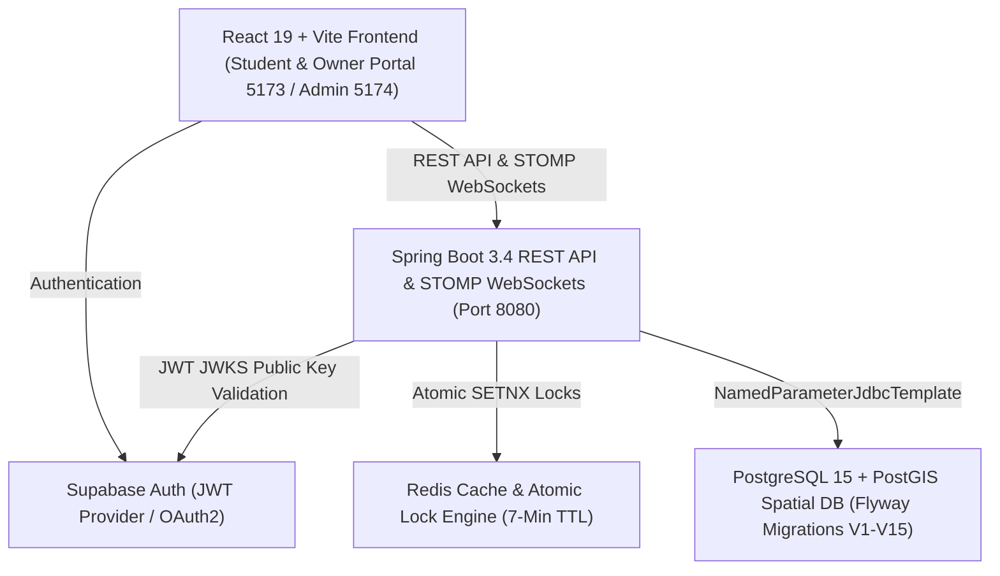

# EduGlobin — Exhaustive System Design, Module Breakdown & App Flow Architecture

---

## 1. Executive Summary & System Architecture

EduGlobin is a high-performance, multi-tenant Study Space, Seat Booking, and Physical Book Circulation ERP Platform built for students, library operators, and educational institutes.



---

## 2. Detailed Module Breakdown (Modules 1–41)

### Phase 1: Core Booking & Library Management
- **Module 1: Multi-Tenant Library Directory & Spatial Search**: PostGIS spatial queries (`ST_DistanceSphere`) ranking libraries by distance, price, and amenities.
- **Module 2: Interactive Blueprint & Seat Grid**: Dynamic layout generation (Classroom, Pods, Perimeter) supporting Standard, Girls Only, Sofa Lounge, and Custom seat tiers.
- **Module 3: Locker Allocation**: Dedicated locker rentals tied to seat bookings with daily/monthly billing.
- **Module 4: Real-Time Seat Status Broadcaster**: STOMP WebSocket topic `/topic/library/{id}/seats` pushing real-time status transitions.
- **Module 5: High-Concurrency 7-Minute Seat Locking**: Redis atomic locks preventing concurrent reservation collisions.

### Phase 2: Integrity, Vacate, Queue & Flexible Slot Rules
- **Module 14: Student Unilateral Vacate**: Student-owned endpoint bypassing owner intervention. Instantly updates booking to `COMPLETED` and releases seat to `AVAILABLE`.
- **Module 15: Vacate Passcode & Owner Cancellation**: Counter vacate requires student-generated 8-character passcode. Owner cancellation requests require explicit student confirmation or 24-hour auto-timeout resolution.
- **Module 26: Two Booking Models by Category**: Govt/Private libraries use fixed shift blocks; Institute libraries use student-chosen flexible custom duration slots (start time + duration).
- **Module 27: Institute Flexible Slot Rules & Interval Overlap Check**: Custom min (30m)/max (4h) booking duration, daily usage cap (6h/day per student), advance booking window (2h), operating hours boundary, and interval overlap check with turnover buffer (5–10m).
- **Module 28: Proactive "Opening Soon" Recommendations**: Surfacing seats freeing up within 60 minutes with live countdown timers when 0 seats are available now.
- **Module 29: FIFO Seat Queue System**: FIFO queue matching waiting students to freed seats with a 2-minute claim window (`status = 'OFFERED'`) and 15-second background sweep (`expireStaleOffers`).
- **Module 30: Queue-Gated Same-Seat Top-Up**: Allows same-seat session extension when the queue is empty; revokes same-seat top-up privileges when another student is waiting.
- **Module 41: Institute Single Active Seat Rule**: Institute-category libraries restrict students to **one active seat at a time** across an institute, preserving queue fairness while allowing session extensions.
- **Module 42: Blocked Top-Up Redirection Engine**: Returns alternative seats available now, opening soon recommendations, or an offer to join the queue for next turn when a top-up is blocked.

### Phase 3: Book Circulation Desk (Modules 31–36)
- **Module 31: Standalone Book Circulation Desk**: Reuses `student_library_profiles` identity layer independently of seat bookings.
- **Module 32: Physical Book Catalog**: Inventory management tracking title, ISBN/code, author, category, total copies, and available copies.
- **Module 33: Counter Book Issue & Reissue**: Physical book checkout, due date calculation, and 1-click renewal/reissue extensions.
- **Module 34: Book Return & Automated Overdue Sweeps**: Book return processing restoring catalog inventory; scheduled cron job sweeping past-due loans to `OVERDUE`.
- **Module 35: Soft-Deactivation Safeguard**: Soft-deactivates student library profiles (`is_active = FALSE`) while blocking deactivation if unreturned books exist.
- **Module 36: Visiting Circulation Students (Issue/Reissue/Return), 40-Min Limit & Exit Approval**: Tracks non-desk visiting students by Institute ID Number for physical book transactions, enforces a 40-minute desk time limit with owner pop-up alerts, supports direct owner exit (saving full visit history), and provides student-initiated exit request with owner approval.

---

## 3. End-to-End App User Flows for Each Role

```mermaid
graph TD
    subgraph StudentFlow ["1. Student User Flow"]
        S1["Discover Libraries via Spatial Search"] --> S2{"Check Category (Institute vs Govt/Private)"}
        S2 -->|Govt/Private| S3a["Select Fixed Shift (Morning/Night)"]
        S2 -->|Institute| S3b["Select Flexible Start Time & Duration (30m-4h)"]
        
        S3a --> S4["7-Min Redis Atomic Lock"]
        S3b --> S4
        
        S4 --> S5{"0 Seats Available?"}
        S5 -->|Yes| S5_Soon["View 'Opening Soon' Seats (Countdown) / Join FIFO Queue (Module 28 & 29)"]
        S5_Soon -->|Seat Offered (2-Min Claim Window)| S6["Claim Offered Seat & Proceed to Checkout"]
        S5 -->|No| S6

        S6 --> S7{"Module 41 Single Seat Check"}
        S7 -->|Pass| S8["UPI / Free Checkout (BOOKED / IN_USE)"]
        S7 -->|Fail| S_Err["Blocked: Active Seat Held elsewhere in Institute"]
        
        S8 --> S9["Gate Check-in via QR / Passcode"]
        S9 --> S10{"Session Approaching End"}
        S10 -->|Request Top-Up| S11{"Module 30 Queue Check (Is Queue Empty?)"}
        S11 -->|Yes| S12["Extend Session Seamlessly"]
        S11 -->|No| S13["Module 42 Redirection: View Available Alternatives / Opening Soon / Queue Next Turn"]
        
        S10 -->|Complete Session| S14["Self-Vacate (Module 14) -> Seat Set to AVAILABLE"]

        V1["Arrive at Desk for Book Issue/Return"] --> V2["Check-In as Circulation Visitor (Institute ID)"]
        V2 --> V3{"Time Present > 40 Mins?"}
        V3 -->|Yes| V_Alert["Red Overtime Alert Triggered on Owner Desk"]
        V3 -->|No| V4["Complete Book Issue / Return"]
        V4 --> V5["Request Desk Exit from App"]
        V5 --> V6["Owner Approves Exit -> Visit Status COMPLETED"]
    end

    subgraph OwnerFlow ["2. Library Owner / Desk Staff Flow"]
        O1["4-Tab Institute Desk Navigation"] --> O2["Seat Layout & Dashboard (Grid Monitor)"]
        O1 --> O3["Circulation Desk & Catalog Manager"]
        O1 --> O4["Gate Scanner & Passcode Validator"]
        O1 --> O5["Walk-In UPI QR Generator"]

        O2 --> O2_Rule["Configure Flexible Slot Rules (Min/Max Mins, Daily Cap, Operating Hours)"]
        O3 --> O_V1["Check-In Visiting Student (Institute ID)"]
        O_V1 --> O_V2{"Overtime Alert Pop-Up (> 40 Mins)"}
        O_V2 -->|Pop-Up| O_V3["Direct Exit & Save History"]
        O_V2 -->|Student Request| O_V4["Approve Exit Request (Institute ID)"]
    end

    subgraph AdminFlow ["3. Super Admin Flow (Port 5174)"]
        A1["Tehsil & LGD Location Onboarding"] --> A2["Fee Ledgers & Commercial Billing"]
        A2 --> A3["Dispute Escalation & Audit Logs"]
        A3 --> A4["Full Database Reset & Auto-Seed"]
    end
```

### A. Student User Flow
1. **Discover & Search**: Student searches libraries by Tehsil, district, shift, category, or library name.
2. **Category-Based Model Selection (Module 26)**:
   - **Govt/Private Libraries**: Student picks fixed shift blocks (Morning, Afternoon, Evening, Night).
   - **Institute Libraries**: Student selects custom flexible duration (30 mins to 4 hours) and start time.
3. **Opening Soon & Seat Queueing (Modules 28 & 29)**:
   - If 0 seats are available now, student views seats opening soon within 60 minutes with live countdown timers.
   - If not available soon enough, student joins the FIFO seat queue with seat tier preferences (`ANY`, `AC_ONLY`, `GIRLS_ONLY`).
   - When a seat frees up, student receives a 2-minute claim window notification (`status = 'OFFERED'`) to claim the seat.
4. **7-Minute Atomic Lock & Single Seat Rule (Module 41)**:
   - Selecting a seat initiates a 7-minute Redis lock. Backend verifies student does not hold another active seat in the institute.
5. **Checkout & Gate Entry**: Student completes checkout (Free pass or UPI/Payment). Gate entry verified via HMAC-SHA256 QR code or passcode.
6. **Queue-Gated Session Top-Up & Redirection (Modules 30 & 42)**:
   - Student prompts "Extend session". If queue is empty, session extends seamlessly.
   - If someone is queued, top-up for that seat is revoked; student is redirected to available alternative seats, opening soon seats, or an offer to queue for their current seat's next turn.
7. **Self-Vacate (Module 14)**: Student taps **Vacate Now**. Booking status updates to `COMPLETED` and seat returns to `AVAILABLE` in real time.
8. **My Books & Circulation Visitor Flow (Modules 31–36)**: Student arriving for book Issue/Reissue/Return without a seat checks in as a circulation visitor. App shows elapsed minutes out of 40 mins and a **Request Desk Exit** button.

### B. Library Owner / Desk Staff Flow
1. **4-Tab Institute Portal**: Presents 4-tab desk navigation (Seat Layout & Dashboard, Book Circulation Desk, Gate Scanner, Walk-In Entry).
2. **Flexible Slot Rules Configurator (Module 27)**: Owner configures min/max booking duration, student daily usage cap, turnover buffer, and operating hours.
3. **Seat Layout & Dashboard**: Real-time interactive grid showing active student names, roll numbers, and seat statuses (`AVAILABLE`, `LOCKED`, `BOOKED`, `IN_USE`, `WAITING`).
4. **Book Circulation Desk & Visitor Overtime Alert (Module 36)**:
   - Search student profiles by Institute ID / Phone.
   - Catalog management, counter book issuing, loan extensions, and returns.
   - Active visitor roster displaying check-in time and elapsed minutes out of 40 mins.
   - **40-Min Overtime Pop-Up Alert**: Red warning banner and pop-up alert when a visitor stays > 40 minutes.
   - **Direct Exit & Exit Approval**: 1-click counter exit or student exit request approval.
5. **Gate Scanner & Walk-In Entry**: Live camera QR scanner or passcode validation; walk-in registration with dynamic UPI QR code.

### C. Super Admin Portal Flow (Port 5174)
1. **LGD & Location Onboarding**: Manage India LGD state, district, sub-district/Tehsil master lists.
2. **Commercial Fee Ledgers**: Track partner library onboarding fees, seat commissions, and financial reconciliations.
3. **Dispute Resolution & Audit Logs**: Inspect system-wide audit logs (`audit_logs`) and resolve student/owner disputes.
4. **Database Diagnostics & Reset**: 1-click database reset and auto-seeding (`reset_db_auto.py`) for system maintenance.

---

## 4. Complete Database Schema Catalog (`db/migration`)

| Migration | Summary of Tables & Schema Changes |
| :--- | :--- |
| **`V1__init_schema.sql`** | PostGIS extension, `users` (id, email, role), `libraries` (id, owner_id, name, geo_point), `shifts`, `seat_desks`, `bookings`. |
| **`V2__day2_schema.sql`** | `lockers` table with rental pricing; adds `locker_id` and `locker_fee` to `bookings`. |
| **`V3__addendum_2_5_schema.sql`** | Amenities flags (`ac_available`, `wifi_available`, `cctv_available`) and proof document fields. |
| **`V4__addendum_2_6_schema.sql`** | Spatial matrix indexing (`row_idx`, `col_idx`) and `is_sofa` flag in `seat_desks`. |
| **`V5__onboarding_enrichment.sql`** | `books_capacity`, `discussion_room_capacity`, base daily seat prices. |
| **`V6__seat_desk_type_flags.sql`** | `is_girls_only`, `is_free`, `custom_type_name`, `custom_type_icon` per-seat flags. |
| **`V7__add_vacate_token.sql`** | Adds `vacate_token` (VARCHAR 8) to `bookings` for dual-confirmation vacating. |
| **`V8__day6_admin_console.sql`** | `audit_logs` and `support_tickets` tables; `approval_status` workflow for libraries. |
| **`V9__student_onboarding.sql`** | `student_profiles` and `student_wallets` (balance) tables. |
| **`V10__institute_libraries_and_student_fields.sql`** | `library_category` (`PRIVATE`, `GOVERNMENT`, `INSTITUTE`), `allowed_email_domain`, college roll & branch fields. |
| **`V11__custom_seat_types_and_shift_pricing.sql`** | `custom_seat_types` table supporting custom seat tier prices per shift. |
| **`V12__add_contact_and_address_to_libraries.sql`** | `contact_number` and `address` columns in `libraries`. |
| **`V13__full_flow_spec_schema.sql`** | `seat_queues` table, multi-day locks, free seat pricing overrides. |
| **`V14__vacate_and_cancellation_integrity.sql`** | `owner_cancellation_requests` table, `vacated_by` metadata, 24-hour auto-timeout resolution. |
| **`V15__book_circulation_schema.sql`** | `library_book_catalog`, `book_loans`, and `student_library_profiles` soft-deactivation columns (`is_active`, `deactivated_at`, `deactivated_by_id`, `deactivation_reason`). |
| **`V16__visiting_circulation_students.sql`** | `visiting_circulation_students` table tracking non-desk circulation visitors, 40-minute limit, direct owner exit, and exit approval workflow. |
| **`V17__institute_flexible_slots_and_queue.sql`** | Flexible slot rule configuration columns on `libraries` (`min_booking_minutes`, `max_booking_minutes`, `max_daily_minutes_per_student`, `advance_booking_max_minutes`, `turnover_buffer_minutes`, `operating_hours_start`, `operating_hours_end`) and `seat_queue_entries` table. |
| **`V27__add_allow_visitor_passes_column.sql`** | Operational `allow_visitor_passes` toggle column on `libraries`. |
| **`V29__private_library_model_modules_48_to_57.sql`** | Private Library Model tables (`monthly_seat_enrollments`, `visitor_temp_passes`, `reserved_seat_attendance_log`, `whatsapp_message_templates`). |
| **`V30__monthly_subscription_toggle_and_locker_modes.sql`** | Private library monthly subscription toggle and locker rental modes. |
| **`V31__extend_locker_charges_monthly_and_visitor.sql`** | Phase 2 Locker Charges — extends locker columns (`has_locker`, `locker_id`, `monthly_locker_fee`/`locker_fee`) to `monthly_seat_enrollments` and `visitor_temp_passes`. |

---

## 5. Key Backend Code Structure

- **`com.eduglobin.booking`**:
  - `BookingService.java`: Checkout execution, free passes, self-vacate, flexible slot validations, single-seat rule check.
  - `BookingController.java`: Seat lock, booking APIs, top-up decision & alternatives endpoints (`/topup-alternatives`).
  - `FlexibleSlotAvailabilityService.java`: Module 27 interval overlap check with turnover buffer, daily usage cap enforcement, advance window & operating hours validation.
  - `OpeningSoonService.java`: Module 28 proactive "Opening Soon" recommendation engine for high-turnover Institute libraries.
  - `SeatQueueService.java`: Module 29 FIFO seat queue join, 2-minute claim window, scheduled job `@Scheduled(fixedDelay = 15000)` matching freed seats to queue entries & expiring stale offers.
  - `SeatQueueController.java`: REST controller exposing seat queue join, status, claim, cancel, and opening-soon endpoints.
  - `SessionTopupService.java`: Module 30 & Module 42 same-seat top-up fairness check (`canTopUpSameSeat`) and top-up blocked redirection engine returning available seats, opening soon seats, or queue option.
  - `SingleActiveSeatRuleService.java`: Institute single active seat per student rule enforcement.
  - `OwnerCancellationService.java`: Owner-initiated vacate request processing with 24h student timeout.
  - `ResourceLockService.java`: Redis atomic 7-minute TTL lock manager.
- **`com.eduglobin.circulation`**:
  - `BookCirculationService.java`: Catalog additions, counter book issuing, reissuing, returning, visitor check-in, 40-min limit tracking, direct exit, student exit request approval, scheduled overdue sweep, profile soft-deactivation.
  - `BookCirculationController.java`: REST controller exposing partner circulation desk, visitor management, & student loan APIs.
- **`com.eduglobin.library`**:
  - `PartnerLibraryController.java`: Library onboarding, layout blueprint matrix builder, live seat status with `hasLocker` & `lockerCode` indicators across all 3 booking paths.
  - `PrivateLibraryManagementService.java`: Monthly seat enrollments (Module 51) with locker add-on & lifecycle held/release, accountless visitor temp passes (Module 54/67) with locker duration pricing, owner CRM roster views with locker columns, visitor audit log.
  - `PrivateLibraryManagementController.java`: Endpoints for monthly enrollments, visitor passes, CRM dashboard, and visitor audit logs.
  - `SimpleCountSeatGenerator.java`: Seat grid matrix layout generator.
- **`com.eduglobin.reporting`**:
  - `PartnerReportsService.java`: Owner Reports & Dashboard KPIs with separate "Locker Revenue" line item across all 3 booking paths, and `hasLocker`/`lockerFee` columns in `getBookingHistory` and `getStudentLookupReport`.
  - `ReportsDashboardDTO.java`: Standardized DTO holding dashboard metrics including `lockerRevenue`.
