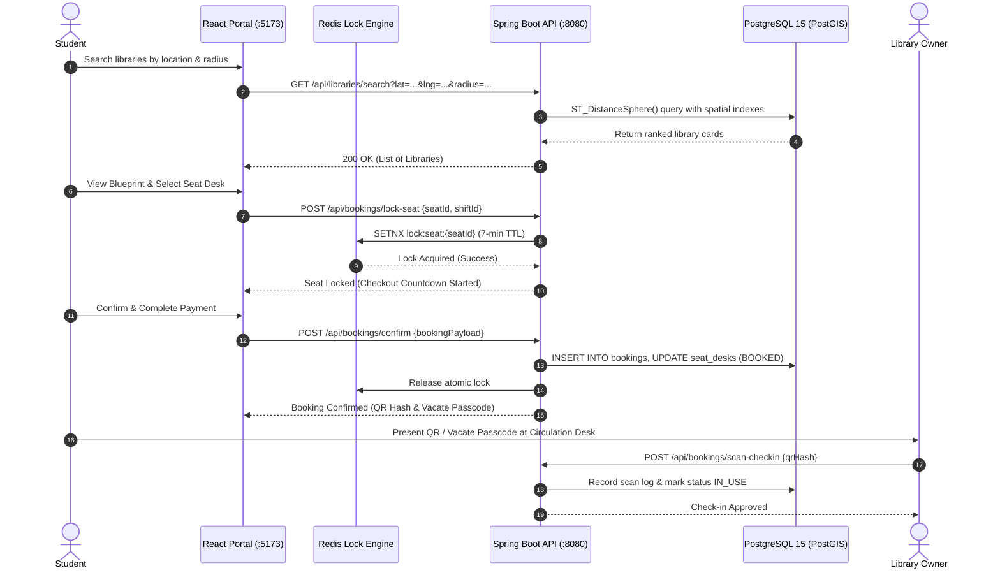

# System Architecture & Flow

EduGlobin is engineered using modern decoupled micro-services, reactive frontend portals, and high-throughput transactional database systems.

---

## 1. High-Level Technology Stack

| Layer | Technologies Used | Primary Responsibilities |
|---|---|---|
| **Frontend Portals** | React 19, TypeScript, Vite, Tailwind CSS / Vanilla CSS, Lucide Icons, STOMP/SockJS | Student Discovery & Booking, Partner Operations, Admin Governance |
| **Authentication** | Supabase Auth (OAuth 2.0 / Passwordless Magic Link / JWT Provider) | Identity lifecycle, JWKS public key token verification |
| **Backend Core** | Spring Boot 3.4 (Java 21 LTS), Spring Security, Spring Data Redis, STOMP WebSockets | Business rules, concurrency locks, REST controllers, scheduled sweeps |
| **Data Storage** | PostgreSQL 15 + PostGIS Spatial Engine | High-integrity relational transactions, spatial distance matching (`ST_DistanceSphere`) |
| **In-Memory Store** | Redis 7 | 7-minute atomic seat locks (`SETNX`), live session state |
| **Migration & Schema** | Flyway (V1 through V36) | Automated zero-downtime evolutionary schema migrations |

---

## 2. End-to-End User Flow Architecture

---

## 3. Concurrency & Integrity Architecture

- **Atomic Seat Locking**: Avoids double-booking using 7-minute Redis atomic locks.
- **Unilateral Vacate**: Allows students to instantly vacate their seat without operator delays.
- **Vacate Passcode**: 8-character secure passcode protects counter-initiated checkouts.
- **FIFO Waitlist Queue**: Auto-allocates vacant seats to queued students with 2-minute claim timers.
