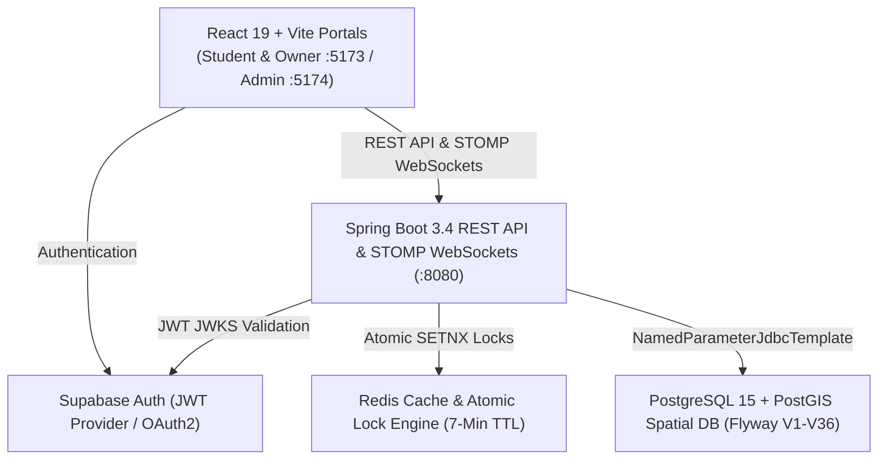

# Welcome to EduGlobin 🚀

**EduGlobin** is a high-performance, multi-tenant Study Space, Seat Booking, and Physical Book Circulation ERP Platform tailored for students, private/institute library operators, and educational campuses.

---

## 🌟 Key Highlights

- **Multi-Tenant Architectural Isolation**: Clean segregation across Private, Government, and Institute library categories.
- **Dynamic Interactive Blueprint**: Row × Column visual seat grid supporting Standard, Girls-Only, Sofa Lounge, and Custom seat tiers.
- **High-Concurrency Seat Locking**: 7-minute atomic Redis locks (`SETNX`) preventing double-booking race conditions during checkout.
- **FIFO Seat Queue Engine**: Automated waitlist queue offering freed seats with a 2-minute claim window and 15-second background sweeps.
- **Physical Book Circulation Desk**: Barcode/ISBN cataloging, issue/reissue workflows, overdue fine sweeps, and visiting student 40-minute exit gates.
- **Private Library CRM & Public Leads**: Complete pipeline tracking inquiries, shift preferences, follow-up dates, and walk-in lead captures.
- **Admin SaaS Subscriptions**: Multi-tiered monetization engine (`BASIC`, `PRO`, `ENTERPRISE`) for library partner management.

---

## 🧭 Documentation Navigation

Explore our comprehensive technical guides:

- **[System Architecture & Design](/docs/architecture/system-design)** — Deep dive into backend services, database pooling, and caching patterns.
- **[Database ER Diagram](/docs/architecture/database-er)** — Interactive Mermaid ER diagram mapping all 36 Flyway schema migrations.
- **[Module Breakdown (1-45+)](/docs/modules/overview)** — Detailed specifications for each platform module.
- **[API Documentation](/docs/api/admin-endpoints)** — Complete REST endpoint schemas and query parameters.
- **[Local Setup & Deployment](/docs/operations/local-setup)** — Step-by-step developer onboarding and runtime scripts.
