# EduGlobin — Database Entity-Relationship (ER) Diagram

This document contains the complete Entity-Relationship (ER) diagram for the **EduGlobin** multi-tenant platform, covering all 36 Flyway schema migrations (`V1` through `V36`).

---

## 1. Visual Entity-Relationship (ER) Diagram

```mermaid
erDiagram
    %% ==========================================
    %% 1. PROFILES & AUTH
    %% ==========================================
    PROFILES ||--o{ LIBRARIES : "owns"
    PROFILES ||--o{ BOOKINGS : "books"
    PROFILES ||--o{ STUDENT_LIBRARY_PROFILES : "has"
    PROFILES ||--o{ COMPLAINT_TICKETS : "files"
    PROFILES ||--o{ AUDIT_LOGS : "acts_in"
    PROFILES ||--o{ COMMUNITY_POSTS : "authors"
    PROFILES ||--o{ COMMUNITY_COMMENTS : "writes"

    PROFILES {
        UUID id PK
        VARCHAR full_name
        VARCHAR role "STUDENT | LIBRARY_OWNER | STAFF | SUPER_ADMIN"
        VARCHAR auth_provider "EMAIL | GOOGLE"
        UUID assigned_library_id FK
        VARCHAR account_status "ACTIVE | PENDING_APPROVAL | SUSPENDED"
        VARCHAR preferred_language
        VARCHAR preferred_theme
        TIMESTAMP created_at
    }

    %% ==========================================
    %% 2. LIBRARIES & SPATIAL HIERARCHY
    %% ==========================================
    LIBRARIES ||--o{ SHIFTS : "defines"
    LIBRARIES ||--o{ SEAT_DESKS : "contains"
    LIBRARIES ||--o{ LOCKERS : "contains"
    LIBRARIES ||--o{ LIBRARY_PHOTOS : "has_gallery"
    LIBRARIES ||--o{ BOOKINGS : "hosts"
    LIBRARIES ||--o{ STUDENT_CRM_RECORDS : "tracks"
    LIBRARIES ||--o{ STUDENT_LIBRARY_PROFILES : "registers"
    LIBRARIES ||--o{ PHYSICAL_BOOKS : "stocks"
    LIBRARIES ||--o{ VISITING_CIRCULATION_STUDENTS : "logs_visitors"
    LIBRARIES ||--o{ SEAT_QUEUE : "manages_queue"
    LIBRARIES ||--o{ FLEXIBLE_SLOT_CONFIGS : "configures"
    LIBRARIES ||--o{ PRIVATE_CRM_LEADS : "manages_leads"
    LIBRARIES ||--o{ PRIVATE_LIBRARY_LEADS : "captures_inquiries"
    LIBRARIES ||--o{ LIBRARY_SUBSCRIPTIONS : "subscribes_to"

    LIBRARIES {
        UUID id PK
        UUID owner_id FK
        VARCHAR name
        VARCHAR slug UK
        VARCHAR category "PRIVATE | GOVERNMENT | INSTITUTE"
        VARCHAR city
        VARCHAR locality
        VARCHAR state
        GEOGRAPHY geo_point
        INT total_seats
        VARCHAR seating_type "CHAIR | SOFA | MIXED | ERGONOMIC"
        BOOLEAN ac_available
        INT girls_safety_score
        BOOLEAN has_girls_section
        INT cancellation_deadline_hours
        BIGINT coins_balance
        BOOLEAN is_published
        BOOLEAN is_verified
        VARCHAR approval_status "PENDING | APPROVED | REJECTED"
        BOOLEAN allow_visitor_passes
        TIMESTAMP created_at
        TIMESTAMP updated_at
    }

    LIBRARY_PHOTOS {
        UUID id PK
        UUID library_id FK
        VARCHAR photo_url
        VARCHAR caption
        INT display_order
        TIMESTAMP created_at
    }

    %% ==========================================
    %% 3. FLOORS, SEATS & SHIFTS
    %% ==========================================
    SEAT_DESKS ||--o{ BOOKINGS : "reserved_by"
    SEAT_DESKS ||--o{ SEAT_QUEUE : "queued_for"
    SEAT_DESKS ||--o{ STUDENT_CRM_RECORDS : "assigned_to"

    SEAT_DESKS {
        UUID id PK
        UUID library_id FK
        VARCHAR seat_code
        INT row_idx
        INT col_idx
        VARCHAR seat_type "STANDARD | GIRLS_ONLY | SOFA_LOUNGE | CUSTOM"
        BOOLEAN is_girls_only
        BOOLEAN has_power_socket
        NUMERIC dist_to_ac_m
        NUMERIC dist_to_door_m
        VARCHAR current_status "AVAILABLE | LOCKED | BOOKED | IN_USE | MAINTENANCE"
    }

    SHIFTS ||--o{ BOOKINGS : "scheduled_in"

    SHIFTS {
        UUID id PK
        UUID library_id FK
        VARCHAR shift_name
        TIME start_time
        TIME end_time
        NUMERIC monthly_price
        NUMERIC daily_price
        TIMESTAMP created_at
    }

    LOCKERS ||--o{ BOOKINGS : "allocated_with"

    LOCKERS {
        UUID id PK
        UUID library_id FK
        VARCHAR locker_code
        NUMERIC price
        VARCHAR duration_type "DAILY | WEEKLY | MONTHLY"
        VARCHAR current_status "AVAILABLE | LOCKED | BOOKED | IN_USE"
    }

    %% ==========================================
    %% 4. BOOKINGS, QUEUES & SLOTS
    %% ==========================================
    BOOKINGS ||--o{ CHECKIN_SCAN_LOGS : "logs_checkin"

    BOOKINGS {
        UUID id PK
        VARCHAR booking_reference UK
        UUID student_id FK
        UUID library_id FK
        UUID shift_id FK
        UUID seat_id FK
        UUID locker_id FK
        VARCHAR booking_mode "FIXED_SHIFT | FLEXIBLE_SLOT | WALK_IN"
        NUMERIC amount_paid
        NUMERIC locker_fee
        VARCHAR qr_payload_hash
        TIMESTAMP valid_from
        TIMESTAMP valid_until
        VARCHAR status "LOCKED | BOOKED | IN_USE | CANCELLED | EXPIRED | COMPLETED"
        VARCHAR vacate_passcode
        TIMESTAMP checked_in_at
        INT total_study_minutes
        TIMESTAMP created_at
    }

    SEAT_QUEUE {
        UUID id PK
        UUID library_id FK
        UUID student_id FK
        UUID target_seat_id FK
        VARCHAR status "WAITING | OFFERED | CLAIMED | EXPIRED | CANCELLED"
        TIMESTAMP offer_expires_at
        TIMESTAMP created_at
    }

    FLEXIBLE_SLOT_CONFIGS {
        UUID id PK
        UUID library_id FK
        INT min_duration_minutes
        INT max_duration_minutes
        INT daily_usage_cap_minutes
        INT advance_booking_window_hours
        INT turnover_buffer_minutes
        TIME opening_time
        TIME closing_time
    }

    %% ==========================================
    %% 5. PROFILES, VERIFICATIONS & CRM
    %% ==========================================
    STUDENT_LIBRARY_PROFILES ||--o{ BOOK_LOANS : "borrows"

    STUDENT_LIBRARY_PROFILES {
        UUID id PK
        UUID student_id FK
        UUID library_id FK
        VARCHAR institute_id_number
        VARCHAR department
        VARCHAR batch_year
        BOOLEAN is_verified
        BOOLEAN is_active
        TIMESTAMP registered_at
    }

    STUDENT_VERIFICATIONS {
        UUID id PK
        UUID student_id FK
        UUID library_id FK
        VARCHAR id_card_photo_url
        VARCHAR aadhaar_masked
        VARCHAR verification_status "PENDING | APPROVED | REJECTED"
        TIMESTAMP reviewed_at
    }

    STUDENT_CRM_RECORDS {
        UUID id PK
        UUID library_id FK
        UUID seat_id FK
        VARCHAR student_name
        VARCHAR contact_number
        VARCHAR masked_aadhaar
        VARCHAR aadhaar_hash
        BOOLEAN aadhaar_verified
        NUMERIC monthly_fee
        NUMERIC admission_fee
        NUMERIC advance_paid
        NUMERIC pending_balance
        VARCHAR payment_status "PREPAID | POSTPAID | OVERDUE | UNPAID"
        BOOLEAN is_vacated
        TIMESTAMP vacated_at
        TIMESTAMP created_at
    }

    %% ==========================================
    %% 6. PHYSICAL BOOK CIRCULATION DESK
    %% ==========================================
    PHYSICAL_BOOKS ||--o{ BOOK_LOANS : "issued_in"

    PHYSICAL_BOOKS {
        UUID id PK
        UUID library_id FK
        VARCHAR title
        VARCHAR isbn
        VARCHAR author
        VARCHAR category
        INT total_copies
        INT available_copies
        TIMESTAMP created_at
    }

    BOOK_LOANS {
        UUID id PK
        UUID physical_book_id FK
        UUID student_library_profile_id FK
        DATE issue_date
        DATE due_date
        DATE return_date
        INT reissue_count
        VARCHAR loan_status "ISSUED | RETURNED | OVERDUE | LOST"
        NUMERIC overdue_fine
        TIMESTAMP created_at
    }

    VISITING_CIRCULATION_STUDENTS {
        UUID id PK
        UUID library_id FK
        VARCHAR student_name
        VARCHAR institute_id_number
        VARCHAR contact_phone
        TIMESTAMP entry_time
        TIMESTAMP exit_time
        INT max_allowed_minutes "DEFAULT 40"
        VARCHAR exit_status "IN_LIBRARY | EXITED | PENDING_APPROVAL"
    }

    %% ==========================================
    %% 7. PRIVATE LIBRARY CRM & LEADS
    %% ==========================================
    PRIVATE_CRM_LEADS {
        UUID id PK
        UUID library_id FK
        VARCHAR full_name
        VARCHAR phone_number
        VARCHAR email
        VARCHAR lead_stage "INQUIRY | DEMO_VISIT | NEGOTIATION | ENROLLED | LOST"
        VARCHAR preferred_shift
        NUMERIC expected_fee
        TEXT notes
        TIMESTAMP follow_up_date
        TIMESTAMP created_at
    }

    PRIVATE_LIBRARY_LEADS {
        UUID id PK
        UUID library_id FK
        VARCHAR visitor_name
        VARCHAR visitor_phone
        VARCHAR inquiry_type "SEAT_BOOKING | LOCKER | GROUP_DISCOUNT"
        VARCHAR status "NEW | CONTACTED | CONVERTED | CLOSED"
        TEXT message
        TIMESTAMP created_at
    }

    %% ==========================================
    %% 8. ADMIN SUBSCRIPTION & BILLING
    %% ==========================================
    ADMIN_SUBSCRIPTION_PLANS ||--o{ LIBRARY_SUBSCRIPTIONS : "defines_tier"

    ADMIN_SUBSCRIPTION_PLANS {
        UUID id PK
        VARCHAR plan_name "BASIC | PRO | ENTERPRISE"
        NUMERIC monthly_price
        NUMERIC annual_price
        INT max_seats_limit
        BOOLEAN crm_enabled
        BOOLEAN analytics_enabled
        BOOLEAN custom_branding
    }

    LIBRARY_SUBSCRIPTIONS {
        UUID id PK
        UUID library_id FK
        UUID plan_id FK
        VARCHAR billing_cycle "MONTHLY | ANNUAL"
        VARCHAR status "ACTIVE | TRIAL | PAST_DUE | CANCELLED"
        TIMESTAMP starts_at
        TIMESTAMP ends_at
        TIMESTAMP created_at
    }

    %% ==========================================
    %% 9. COMMUNITY, COMPLAINTS & AUDIT
    %% ==========================================
    COMMUNITY_POSTS ||--o{ COMMUNITY_COMMENTS : "has_comments"

    COMMUNITY_POSTS {
        UUID id PK
        UUID author_id FK
        VARCHAR category "STUDY_TIPS | EXAM_PREP | RESOURCE_SHARE | GENERAL"
        VARCHAR title
        TEXT content
        INT upvote_count
        TIMESTAMP created_at
    }

    COMMUNITY_COMMENTS {
        UUID id PK
        UUID post_id FK
        UUID author_id FK
        TEXT comment_text
        TIMESTAMP created_at
    }

    COMPLAINT_TICKETS {
        UUID id PK
        VARCHAR ticket_code UK
        UUID library_id FK
        UUID student_id FK
        VARCHAR category
        VARCHAR priority "NORMAL | HIGH | URGENT"
        TEXT description
        VARCHAR status "PENDING | UNDER_REVIEW | RESOLVED"
        TIMESTAMP sla_deadline
        TEXT owner_resolution_notes
        TIMESTAMP resolved_at
        TIMESTAMP created_at
    }

    AUDIT_LOGS {
        UUID id PK
        UUID actor_id FK
        VARCHAR actor_role
        VARCHAR action
        VARCHAR entity_type
        UUID entity_id
        JSONB before_value
        JSONB after_value
        VARCHAR ip_address
        TIMESTAMP created_at
    }

    POINTS_COINS_LEDGER {
        UUID id PK
        VARCHAR account_type "STUDENT_POINTS | LIBRARY_COINS"
        UUID account_id
        INT delta
        VARCHAR reason
        UUID reference_id
        TIMESTAMP created_at
    }

    INDIA_ADMIN_HIERARCHY {
        UUID id PK
        VARCHAR village_or_area
        VARCHAR tehsil
        VARCHAR district
        VARCHAR state
        DOUBLE lat
        DOUBLE lng
        BOOLEAN is_featured_hub
    }
```

---

## 2. Core Domain Table Breakdown

| Domain | Tables | Primary Keys & Relationships |
|---|---|---|
| **Auth & Profiles** | `profiles` | Extends Supabase `auth.users(id)`; references `libraries.id` for staff assignments |
| **Libraries & Spaces** | `libraries`, `shifts`, `seat_desks`, `lockers`, `library_photos` | Multi-tenant hierarchy; cascade-deleted from `libraries` |
| **Reservations & Queues** | `bookings`, `seat_queue`, `flexible_slot_configs`, `checkin_scan_logs` | FKs to `profiles`, `libraries`, `shifts`, `seat_desks`, `lockers` |
| **Identity & Student Layer** | `student_library_profiles`, `student_verifications`, `student_crm_records` | Library-specific student enrollment & verification |
| **Book Circulation** | `physical_books`, `book_loans`, `visiting_circulation_students` | Circulation desk inventory & loan records |
| **Private Library CRM** | `private_crm_leads`, `private_library_leads` | Multi-stage lead management & walk-in inquiries |
| **Subscriptions & Billing** | `admin_subscription_plans`, `library_subscriptions` | SaaS tier management for library owners |
| **Community & Governance** | `community_posts`, `community_comments`, `complaint_tickets`, `audit_logs`, `points_coins_ledger` | Student forum, ticketing SLA enforcement, audit trail |
| **Spatial & Geography** | `india_admin_hierarchy` | PostGIS spatial indexing & LGD open data hub hierarchy |
