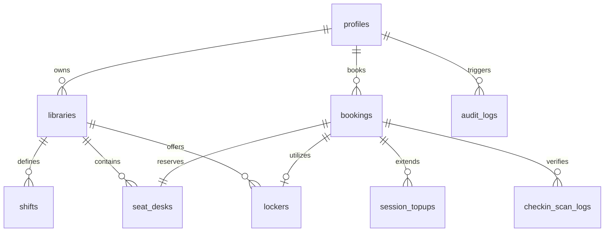

# EduGlobin System Documentation (Days 1 – 5.1)

This document provides a detailed catalog of every file created and modified during Days 1 through 5.1 of the EduGlobin sprint. It describes what each file does, the current database schema, and the core application flows.

---

## 1. Catalog of Created and Modified Files

### Day 1 — Auth & Schema Foundation
*   **[`V1__init_schema.sql`](file:///e:/EduGlobin/backend/src/main/resources/db/migration/V1__init_schema.sql)** [NEW]
    *   *Role*: Establishes the initial database tables (profiles, libraries, shifts, seat_desks, bookings, CRM records, tickets, scan logs, audit logs, ledger, hierarchy) to avoid schema drift across sprint days.
*   **[`SecurityConfig.java`](file:///e:/EduGlobin/backend/src/main/java/com/eduglobin/config/SecurityConfig.java)** [MODIFY]
    *   *Role*: Configures Spring Security as a stateless OAuth2 Resource Server validating HMAC-SHA256 JWTs issued by Supabase Auth, mapping roles to granted authorities.
*   **[`UserPrincipal.java`](file:///e:/EduGlobin/backend/src/main/java/com/eduglobin/common/UserPrincipal.java)** [NEW]
    *   *Role*: Helper utility to extract authenticated user parameters (UUID, role, email) from raw Spring Security JWT principal tokens.
*   **[`AdminSeedRunner.java`](file:///e:/EduGlobin/backend/src/main/java/com/eduglobin/auth/AdminSeedRunner.java)** [MODIFY]
    *   *Role*: Bootstraps the first `SUPER_ADMIN` credentials on startup using the Supabase Admin API, gated under `@Profile("!test")` to prevent unit test failures.

### Day 2 — LGD Hierarchy & Scored Search
*   **[`lgd_data.csv`](file:///e:/EduGlobin/backend/src/main/resources/seed-data/lgd_data.csv)** [NEW]
    *   *Role*: Representative CSV dataset of Indian administrative boundaries down to villages/areas, highlighting student hubs.
*   **[`LgdSeedRunner.java`](file:///e:/EduGlobin/backend/src/main/java/com/eduglobin/library/LgdSeedRunner.java)** [MODIFY]
    *   *Role*: Reads `lgd_data.csv` and bulk-inserts location rows in one batch, flagging Indore, Kota, Sikar, and Delhi as featured hubs.
*   **[`TehsilGeocodeRunner.java`](file:///e:/EduGlobin/backend/src/main/java/com/eduglobin/library/TehsilGeocodeRunner.java)** [NEW]
    *   *Role*: Resolves base coordinates for distinct tehsils. Utilizes Google Geocoding API if a key is available, falling back to a static registry or state-centered offsets.
*   **[`OnDemandVillageGeocodeService.java`](file:///e:/EduGlobin/backend/src/main/java/com/eduglobin/library/search/OnDemandVillageGeocodeService.java)** [NEW]
    *   *Role*: Lazily refines a village's coordinates when it is searched and matches its parent tehsil's default coordinates, caching the precise location.
*   **[`LocationResult.java`](file:///e:/EduGlobin/backend/src/main/java/com/eduglobin/library/search/LocationResult.java)** [MODIFY]
    *   *Role*: Extension to represent a matched LGD location including its `precision` label (`VILLAGE` or `TEHSIL`).
*   **[`LocationController.java`](file:///e:/EduGlobin/backend/src/main/java/com/eduglobin/library/search/LocationController.java)** [MODIFY]
    *   *Role*: Exposes LGD search endpoint, triggering lazy geocoding upgrades for matched search rows.
*   **[`LibrarySearchRepository.java`](file:///e:/EduGlobin/backend/src/main/java/com/eduglobin/library/search/LibrarySearchRepository.java)** [NEW]
    *   *Role*: Formulates PostGIS queries to filter libraries based on physical distance (`ST_DWithin`) and features.
*   **[`LibraryScoringService.java`](file:///e:/EduGlobin/backend/src/main/java/com/eduglobin/library/search/LibraryScoringService.java)** [MODIFY]
    *   *Role*: Computes deterministic, normalized match scores using a weighted formula. Gracefully returns a neutral `0.5` coefficient for missing preferences.
*   **[`LibrarySearchService.java`](file:///e:/EduGlobin/backend/src/main/java/com/eduglobin/library/search/LibrarySearchService.java)** [NEW]
    *   *Role*: Integrates candidate retrieval and scoring, returning sorted results to the user.
*   **[`LibrarySearchController.java`](file:///e:/EduGlobin/backend/src/main/java/com/eduglobin/library/search/LibrarySearchController.java)** [NEW]
    *   *Role*: Exposes REST API endpoint `GET /api/v1/libraries/search` mapping parameters to the search service.
*   **[`SearchPage.tsx`](file:///e:/EduGlobin/frontend/src/pages/SearchPage.tsx)** / **[`RecommendPage.tsx`](file:///e:/EduGlobin/frontend/src/pages/RecommendPage.tsx)** [MODIFY]
    *   *Role*: Renders manual filter search and AI Solver preferences wizard interfaces, using the same backend API.
*   **[`tsconfig.app.json`](file:///e:/EduGlobin/frontend/tsconfig.app.json)** [MODIFY]
    *   *Role*: Loads Vite environment typings (`"types": ["vite/client"]`) and disables strict unused parameters/locals compilation blocks.

### Day 2.5 — Onboarding, Lockers & Walk-Ins
*   **[`V3__addendum_2_5_schema.sql`](file:///e:/EduGlobin/backend/src/main/resources/db/migration/V3__addendum_2_5_schema.sql)** [NEW]
    *   *Role*: Alters database tables to support library onboarding sources, approval states, locker modes, tiered prices, booking payment modes, walk-in sources, manual checking methods, and creates the `session_topups` table.
*   **[`LibraryOnboardingRequest.java`](file:///e:/EduGlobin/backend/src/main/java/com/eduglobin/library/LibraryOnboardingRequest.java)** [NEW]
    *   *Role*: DTO containing validation gates for submitting complete library profiles (shifts, seats, and KYC documents).
*   **[`LibraryOnboardingService.java`](file:///e:/EduGlobin/backend/src/main/java/com/eduglobin/library/LibraryOnboardingService.java)** [NEW]
    *   *Role*: Handles validation logic, writes new library records, inserts associated shifts and seat layouts, and manages approval transitions.
*   **[`LibraryOnboardingController.java`](file:///e:/EduGlobin/backend/src/main/java/com/eduglobin/library/LibraryOnboardingController.java)** [NEW]
    *   *Role*: REST endpoints allowing owners to submit listings, and admins to review, approve, reject, or request changes.
*   **[`Locker.java`](file:///e:/EduGlobin/backend/src/main/java/com/eduglobin/library/Locker.java)** [NEW]
    *   *Role*: Locker model representing tiered pricing structures (`price_hourly`, `price_daily`, `price_weekly`, `price_monthly`).
*   **[`LockerMode.java`](file:///e:/EduGlobin/backend/src/main/java/com/eduglobin/library/LockerMode.java)** [NEW]
    *   *Role*: Enum for library locker models (`NO_LOCKERS`, `FREE_LOCKERS`, `PAID_MANAGED`).
*   **[`LockerConfigDto.java`](file:///e:/EduGlobin/backend/src/main/java/com/eduglobin/library/LockerConfigDto.java)** [NEW]
    *   *Role*: DTO mapping locker pricing setups submitted by library owners.
*   **[`LockerService.java`](file:///e:/EduGlobin/backend/src/main/java/com/eduglobin/library/LockerService.java)** [NEW]
    *   *Role*: Implements checkout locker fee resolution, locker installations, and check-in confirmation workflows (supporting QR scans and manual reference fallbacks).
*   **[`LockerController.java`](file:///e:/EduGlobin/backend/src/main/java/com/eduglobin/library/LockerController.java)** [NEW]
    *   *Role*: Exposes owner configurations and staff-facing check-in confirmation REST endpoints.
*   **[`WalkInRequest.java`](file:///e:/EduGlobin/booking/WalkInRequest.java)** [NEW]
    *   *Role*: DTO defining quick entry details for students arriving without prior bookings.
*   **[`TopUpRequest.java`](file:///e:/EduGlobin/booking/TopUpRequest.java)** [NEW]
    *   *Role*: DTO specifying additional extension hours and payment methods.
*   **[`WalkInService.java`](file:///e:/EduGlobin/booking/WalkInService.java)** [NEW]
    *   *Role*: Automatically registers walk-in student auth rows, initializes bookings as `IN_USE` directly (Cash) or `BOOKED` (UPI with dynamic QR code generation), manages session extensions, and logs coins ledger entries.
*   **[`WalkInController.java`](file:///e:/EduGlobin/booking/WalkInController.java)** [NEW]
    *   *Role*: Exposes walk-in entry, top-up session, and simulation payment gateway webhook endpoints.
*   **[`LockerServiceTest.java`](file:///e:/EduGlobin/backend/src/test/java/com/eduglobin/library/LockerServiceTest.java)** [NEW]
    *   *Role*: Verifies the correctness of the locker pricing resolution logic under all modes and pass types.

---

## 2. Current Database Structure

Here is a visual map showing the table relationships after the additions in migration `V3`:



### Table Properties & Alterations
1.  **`libraries`**: Includes onboarding tracks (`onboarding_source`), review statuses (`approval_status`), rejection descriptions, admin identifiers, and `locker_mode`.
2.  **`lockers`**: Tracks status and tiered rates `price_hourly`, `price_daily`, `price_weekly`, and `price_monthly` in place of single duration entries.
3.  **`bookings`**: Stores pass type, walk-in indicators, offline cash/UPI parameters, and staff check-in IDs.
4.  **`checkin_scan_logs`**: Tracks confirmation methods (`QR_SCAN` or `MANUAL_ID`) alongside scanned data.
5.  **`session_topups`**: New table recording incremental payments and valid-until extension histories.

---

## 3. Core Application Flows

### Flow A: Owner Onboarding and Admin Approval
1.  **Initiation**:
    *   **Owner**: Submits full registration form via `POST /api/v1/owner/libraries`.
    *   **Admin**: Inserts library details on behalf of the owner, tagging `onboarding_source = 'ADMIN_INITIATED'`.
2.  **Validation Gate**: The `LibraryOnboardingService` validates that the KYC proof, shifts list, and at least one seat map configuration are present.
3.  **Queue**: Listing starts in a `PENDING_APPROVAL` status (hidden from student search results).
4.  **Review**: Admin inspects the listing in the console, calling `approve`, `reject`, or `request-changes`.
5.  **Activation**: On approval, `is_published = TRUE` is set, and the library appears live immediately.

### Flow B: Locker Add-on Checkout
1.  **Pass Check**: The checkout engine resolves the student's selected pass type (Hourly/Daily/Weekly/Monthly).
2.  **Fee Calculation**: If `locker_mode == 'PAID_MANAGED'`, the locker price is matched against the corresponding pricing tier. If `FREE_LOCKERS`, a fee of ₹0 is assigned.
3.  **Binding**: The seat reservation and locker booking are created as a single record under `bookings`, sharing identical `valid_from` and `valid_until` windows.

### Flow C: Walk-In Entry & Top-Up
1.  **Registration**: An owner selects an `AVAILABLE` desk and submits the student's name and contact number.
2.  **Account Provisioning**: The service automatically creates a profile in `auth.users` and `profiles` for the student.
3.  **Payment Processing**:
    *   **Cash**: The booking transitions directly to `IN_USE`, updating seat/locker states. Coins ledger records cash collection.
    *   **UPI**: Returns a dynamic `upi://` deep link string. The seat remains `BOOKED` until a webhook signal is received to activate it.
4.  **Extension**: For session top-ups, the incremental amount and new expiration time are written to `session_topups`, and the parent booking's `valid_until` is updated upon payment.

---

## Day 3 — Live Seat Map, Redis Locking Engine & Booking Checkout

### New Files

#### Backend — Locking Engine
*   **[`ResourceLockService.java`](file:///e:/EduGlobin/backend/src/main/java/com/eduglobin/booking/ResourceLockService.java)** [NEW]
    *   *Role*: Generalized Redis lock for any bookable resource type (`SEAT`, `LOCKER`, or any future type). Uses atomic `SETNX` to acquire 7-minute locks keyed as `lock:{type}:{resourceId}`. Release uses a Lua script (`GET + DEL if token matches`) to prevent cross-user race conditions on expiry. Returns an `Optional<String>` lock token on success, or empty on conflict.
*   **[`LockReconciliationJob.java`](file:///e:/EduGlobin/backend/src/main/java/com/eduglobin/booking/LockReconciliationJob.java)** [NEW]
    *   *Role*: `@Scheduled` background job running every 30 seconds. Queries the database for seats/lockers stuck in `LOCKED` status whose Redis lock key has expired, reverts them to `AVAILABLE`, and broadcasts the state change via WebSocket so every open viewer sees the update without refresh.

#### Backend — WebSocket Broadcasting
*   **[`SeatStatusBroadcaster.java`](file:///e:/EduGlobin/backend/src/main/java/com/eduglobin/booking/SeatStatusBroadcaster.java)** [NEW]
    *   *Role*: Spring STOMP/WebSocket broadcaster. Publishes seat and locker status-change events to `/topic/library/{libraryId}/seats`, carrying `resourceType`, `resourceId`, `status`, and `timestamp`. All consumers (open seat map tabs) receive these events immediately without page reload.
*   **[`WebSocketConfig.java`](file:///e:/EduGlobin/backend/src/main/java/com/eduglobin/config/WebSocketConfig.java)** [EXISTING — was a Day 1 stub, now fully active]
    *   *Role*: Enables STOMP-over-SockJS at `/ws`, sets broker destination prefix `/topic`, and application destination prefix `/app`.

#### Backend — REST APIs
*   **[`LibraryDetailController.java`](file:///e:/EduGlobin/backend/src/main/java/com/eduglobin/library/LibraryDetailController.java)** [NEW]
    *   *Role*: Two endpoints — `GET /api/v1/libraries/{id}/shifts` (shift timings and prices) and `GET /api/v1/libraries/{id}/seats?shiftId=...` (all seats and lockers with live status resolved by checking Redis keys and active bookings for the requested shift).
*   **[`BookingController.java`](file:///e:/EduGlobin/backend/src/main/java/com/eduglobin/booking/BookingController.java)** [NEW]
    *   *Role*: Two endpoints — `POST /api/v1/resources/lock` (lock a seat or locker for 7 min, returns token + price) and `POST /api/v1/bookings/checkout` (verify locks, verify test payment nonce, commit booking, flip DB statuses, broadcast updates, release locks).
*   **[`LockResourceRequest.java`](file:///e:/EduGlobin/backend/src/main/java/com/eduglobin/booking/LockResourceRequest.java)** [NEW]
    *   *Role*: Request DTO for the resource lock endpoint (`resourceType`, `resourceId`, `libraryId`, `shiftId`).
*   **[`CheckoutRequest.java`](file:///e:/EduGlobin/backend/src/main/java/com/eduglobin/booking/CheckoutRequest.java)** [NEW]
    *   *Role*: Request DTO for the checkout endpoint including seat and optional locker lock tokens, shift/library identifiers, pass type, and payment nonce.
*   **[`BookingService.java`](file:///e:/EduGlobin/backend/src/main/java/com/eduglobin/booking/BookingService.java)** [NEW]
    *   *Role*: `@Transactional` checkout business logic: verifies both Redis lock tokens are still valid, validates payment nonce (test/sandbox mode), computes seat price from shift pricing tier and locker fee from tiered rates, inserts the `bookings` row, updates `seat_desks` + `lockers` to `BOOKED`, broadcasts WebSocket events, releases locks, writes `points_coins_ledger` entries, and writes to `audit_logs`.

#### Backend — Tests
*   **[`ResourceLockServiceTest.java`](file:///e:/EduGlobin/backend/src/test/java/com/eduglobin/booking/ResourceLockServiceTest.java)** [NEW]
    *   *Role*: Unit tests covering all lock paths: successful acquire, conflict (returns empty), token verification match/mismatch/null, Lua-scripted release invocation, key naming format (`lock:TYPE:UUID`), and null-token short-circuit on release.
*   **[`EduGlobinApplicationTests.java`](file:///e:/EduGlobin/backend/src/test/java/com/eduglobin/EduGlobinApplicationTests.java)** [MODIFY]
    *   *Role*: Added `@MockBean` entries for `StringRedisTemplate` and `SimpMessagingTemplate` so the Spring context loads cleanly in the test environment where Redis and WebSocket auto-configuration are excluded.

#### Modified Files
*   **[`EduGlobinApplication.java`](file:///e:/EduGlobin/backend/src/main/java/com/eduglobin/EduGlobinApplication.java)** [MODIFY]
    *   *Change*: Added `@EnableScheduling` to activate the `LockReconciliationJob`.

#### Frontend
*   **[`SeatGrid.tsx`](file:///e:/EduGlobin/frontend/src/components/SeatMap/SeatGrid.tsx)** [NEW]
    *   *Role*: Reusable seat/locker grid component. Renders seats in row/column order from `row_idx`/`col_idx` coordinates. Applies five distinct status styles (`AVAILABLE` = green, `LOCKED` = pulsing amber, `BOOKED` = blue, `IN_USE` = red, `MAINTENANCE` = grey). Shows a "your selection" indigo ring when the student has locked a seat. Renders locker cards below the grid with per-pass-type price display and a free/paid toggle.
*   **[`useSeatMapUpdates.ts`](file:///e:/EduGlobin/frontend/src/hooks/useSeatMapUpdates.ts)** [NEW]
    *   *Role*: Custom hook encapsulating live update transport. Tries STOMP/SockJS WebSocket first; if the connection fails or doesn't establish within 2 seconds, silently falls back to 3-second interval polling of `GET /api/v1/libraries/{id}/seats`. Callers receive seat/locker status events through one uniform callback regardless of transport.
*   **[`LibraryDetailPage.tsx`](file:///e:/EduGlobin/frontend/src/pages/LibraryDetailPage.tsx)** [NEW]
    *   *Role*: Full library detail and booking experience page at `/libraries/:id`. Features: sticky header with 7-minute countdown timer; shift selector; pass type selector (Hourly/Daily/Weekly/Monthly) with estimated prices; live `SeatGrid`; locker add-on toggle (shown only when library has lockers available); optimistic-lock-then-confirm seat selection; checkout summary panel with "Pay & Book" button; booking confirmation screen with reference number and Day 4 QR placeholder note.
*   **[`router.tsx`](file:///e:/EduGlobin/frontend/src/router.tsx)** [MODIFY]
    *   *Change*: Added route `/libraries/:id → LibraryDetailPage`.
*   **[`SearchPage.tsx`](file:///e:/EduGlobin/frontend/src/pages/SearchPage.tsx)** [MODIFY]
    *   *Change*: "Book Desk" button now navigates to `/libraries/{id}` using `useNavigate`.

---

## 4. Locking Architecture (Day 3)

```
Student clicks seat               → POST /api/v1/resources/lock
  Backend: Redis SETNX             → returns lockToken (TTL=420s) or 409
  Backend: UPDATE seat_desks       → status = LOCKED
  Backend: WebSocket broadcast     → /topic/library/{id}/seats
  All open tabs receive event      → seat turns amber

Student pays & submits checkout   → POST /api/v1/bookings/checkout
  Backend: verifyLock (Redis GET)  → token still matches?
  Backend: @Transactional:
    INSERT bookings row            → status = BOOKED
    UPDATE seat_desks              → status = BOOKED
    UPDATE lockers (if selected)   → status = BOOKED
    WebSocket broadcast            → all tabs show seat as blue
  Backend: Lua-scripted release    → Redis key deleted atomically

If student abandons checkout:
  Redis TTL expires after 7 min   → key deleted automatically
  LockReconciliationJob (30s)     → finds LOCKED seat with no Redis key
                                  → UPDATE seat_desks → AVAILABLE
                                  → WebSocket broadcast → seat turns green
```

### Concurrency Guarantee
Two students clicking the same seat simultaneously both hit `Redis SETNX`. Redis processes these atomically — exactly one `SETNX` returns `true`, the other returns `false`. The losing student gets a `409 ALREADY_LOCKED` response and the frontend shows "That seat was just taken". This prevents double-bookings at the infrastructure level, not just the application level.

---

## Day 4 — Cancellation Engine, Dispute Resolution, Price Governance, Owner Confirmation Window

### Schema (V4)
*   **[`V4__addendum_2_6_schema.sql`](file:///e:/EduGlobin/backend/src/main/resources/db/migration/V4__addendum_2_6_schema.sql)** [NEW]
    *   Adds: `is_free` flag on libraries, `layout_source` on `seat_desks`, `scope` on `complaint_tickets`, price-change governance columns on `shifts` (`pending_monthly_price`, `pending_daily_price`, `price_change_status`), `platform_config` key-value table, `owner_confirmation_status`/`deadline` on `bookings`, cancellation columns (`cancelled_by_id`, `cancelled_by_role`, `cancellation_reason`, `cancellation_initiated_at`, `identity_confirmed`), `booking_disputes` table, `cancellation_refund_tiers` table, `student_wallets`, and `wallet_transactions`.

### Backend — Cancellation & Refund Engine (Module 19)
*   **[`CancellationService.java`](file:///e:/EduGlobin/backend/src/main/java/com/eduglobin/booking/CancellationService.java)** [NEW]
    *   *Role*: Tiered refund calculator that reads `cancellation_refund_tiers` from the database (not hardcoded), computes refund percentage based on hours before the shift start, processes wallet-based fines, and logs the cancellation with full actor attribution (`cancelled_by_id`, `cancelled_by_role`). Supports cancellations by Student, Owner, or Admin.
*   **[`CancellationController.java`](file:///e:/EduGlobin/backend/src/main/java/com/eduglobin/booking/CancellationController.java)** [NEW]
    *   *Role*: REST endpoints for students to cancel their own bookings (`DELETE /api/v1/bookings/{id}/cancel`), and for owners/staff to cancel on behalf of students (`DELETE /api/v1/partner/bookings/{id}/cancel`).

### Backend — Dispute Resolution (Module 19)
*   **[`DisputeService.java`](file:///e:/EduGlobin/backend/src/main/java/com/eduglobin/booking/DisputeService.java)** [NEW]
    *   *Role*: When a cancellation is disputed ("This wasn't me"), uses the server's authoritative `cancelled_by_id` to auto-reject (disputer IS the recorded actor) or escalate to Admin (disputer is NOT the actor). Creates `booking_disputes` rows with `AUTO_REJECTED` or `ESCALATED` status. Also exposes `resolveDispute()` for Staff/Admin to mark escalated disputes as `RESOLVED_REFUND` or `RESOLVED_NO_REFUND`.

### Backend — Price-Change Governance (Module 17)
*   **[`PriceChangeService.java`](file:///e:/EduGlobin/backend/src/main/java/com/eduglobin/library/PriceChangeService.java)** [NEW]
    *   *Role*: Reads the configurable threshold from `platform_config` (default 20%). Price changes below threshold apply immediately; above threshold stages in `pending_*` columns for Admin review. Admin approve/reject methods update the shift prices accordingly.
*   **[`PriceChangeController.java`](file:///e:/EduGlobin/backend/src/main/java/com/eduglobin/library/PriceChangeController.java)** [NEW]
    *   *Role*: Owner endpoint `PUT /owner/shifts/{shiftId}/price`, Admin endpoints `POST /admin/price-changes/{shiftId}/approve` and `POST /admin/price-changes/{shiftId}/reject`, plus a pending queue listing `GET /admin/price-changes/pending` (stub for Day 6 UI).

### Backend — Owner Confirmation Window (Module 18)
*   **[`OwnerConfirmationJob.java`](file:///e:/EduGlobin/backend/src/main/java/com/eduglobin/booking/OwnerConfirmationJob.java)** [NEW]
    *   *Role*: Scheduled job running every 60 seconds. Checks for bookings past their `owner_confirmation_deadline` that remain `PENDING` and auto-confirms them (preventing owners from silently ignoring student bookings). Broadcasts status updates via WebSocket.
*   **[`QrPassService.java`](file:///e:/EduGlobin/backend/src/main/java/com/eduglobin/booking/QrPassService.java)** [NEW]
    *   *Role*: Generates SHA-256 check-in tokens that encode `booking_id + student_id + shift_id`, creating a tamper-proof reference for QR-based entry verification.
*   **[`CheckInService.java`](file:///e:/EduGlobin/backend/src/main/java/com/eduglobin/booking/CheckInService.java)** [NEW]
    *   *Role*: Validates QR tokens on check-in, verifies booking is in `CONFIRMED`/`AUTO_CONFIRMED` state and within the correct shift time window, transitions seat to `IN_USE`, writes `checkin_scan_logs`, and broadcasts the seat change.

### Backend — Owner-Facing Booking Views
*   **[`PartnerBookingController.java`](file:///e:/EduGlobin/backend/src/main/java/com/eduglobin/booking/PartnerBookingController.java)** [NEW]
    *   *Role*: Owner-scoped booking management: list today's bookings, confirm/reject pending reservations, and cancel bookings as the owner role.
*   **[`OwnerFacingBookingView.java`](file:///e:/EduGlobin/backend/src/main/java/com/eduglobin/booking/OwnerFacingBookingView.java)** [NEW]
    *   *Role*: DTO projection for how a booking appears to the library owner (student name, seat code, shift, status, check-in time).

### Backend — Student CRM (Module 14)
*   **[`StudentCrmService.java`](file:///e:/EduGlobin/backend/src/main/java/com/eduglobin/crm/StudentCrmService.java)** [NEW]
    *   *Role*: Manages student CRM records scoped to each library: creates/updates records when students book, tracks fee ledger (paid/due/pending), vacation notices, and historical visit data.
*   **[`StudentCrmController.java`](file:///e:/EduGlobin/backend/src/main/java/com/eduglobin/crm/StudentCrmController.java)** [NEW]
    *   *Role*: REST endpoints for owners to view, filter, and manage their library's enrolled students.
*   **[`FeeLedgerService.java`](file:///e:/EduGlobin/backend/src/main/java/com/eduglobin/crm/FeeLedgerService.java)** [NEW]
    *   *Role*: Records financial transactions per student-library pair, computing running totals for paid/due amounts.

### Frontend — Student Dashboard
*   **[`StudentDashboardPage.tsx`](file:///e:/EduGlobin/frontend/src/pages/StudentDashboardPage.tsx)** [NEW]
    *   *Role*: Personal dashboard for logged-in students. Shows active bookings with QR pass, upcoming reservations, past booking history, wallet balance, and allows cancellation with the refund tier preview.
*   **[`BookingConfirmationPage.tsx`](file:///e:/EduGlobin/frontend/src/pages/BookingConfirmationPage.tsx)** [NEW]
    *   *Role*: Post-checkout confirmation screen with booking reference, QR code display, and instructions for check-in.

### Frontend — Admin Portal
*   **[`AdminPortalPage.tsx`](file:///e:/EduGlobin/frontend/src/pages/AdminPortalPage.tsx)** [NEW]
    *   *Role*: Restricted operational console at `/admin-portal` (port 5174). Features: role-gated login (Staff/Admin), metrics grid, library verification queue with full dossier expansion, approve/reject/request-changes actions with reason input. Deliberately dark monochrome design, visually distinct from the consumer-facing app.

---

## Day 5 — Owner Operational Portal, Onboarding Wizard, Seat Blueprint System

### Schema (V5, V6, V7)
*   **[`V5__onboarding_enrichment.sql`](file:///e:/EduGlobin/backend/src/main/resources/db/migration/V5__onboarding_enrichment.sql)** [NEW]
    *   Adds: `email`, `has_discussion_room`, `discussion_room_capacity`, amenity booleans (`wifi_available`, `cctv_available`, `power_backup_available`, `water_dispenser_available`, `newspaper_available`), `books_capacity`, `available_books_data`, dual base pricing (`base_desk_price_daily`, `base_desk_price_monthly`), sofa pricing, `layout_type`, `layout_file_url`, proof document fields.
*   **[`V6__seat_desk_type_flags.sql`](file:///e:/EduGlobin/backend/src/main/resources/db/migration/V6__seat_desk_type_flags.sql)** [NEW]
    *   Adds: `is_girls_only`, `has_power_socket`, `is_sofa`, `is_free`, `seat_type` columns on `seat_desks` table.
*   **[`V7__add_vacate_token.sql`](file:///e:/EduGlobin/backend/src/main/resources/db/migration/V7__add_vacate_token.sql)** [NEW]
    *   Adds: `vacate_token` column on `bookings` for secure vacate/checkout workflows.

### Backend — Onboarding Service (Enhanced)
*   **[`LibraryOnboardingService.java`](file:///e:/EduGlobin/backend/src/main/java/com/eduglobin/library/LibraryOnboardingService.java)** [MODIFY]
    *   *Changes*: Extended to persist all enriched onboarding fields (email, amenities, books, pricing tiers, sofa pricing, layout type, proof documents). Now inserts seat-level feature flags (`is_girls_only`, `has_power_socket`, `is_sofa`, `is_free`, `seat_type`) for each generated seat. Added `getMyLibrary()` that joins shift data for the authenticated owner.
*   **[`LibraryOnboardingRequest.java`](file:///e:/EduGlobin/backend/src/main/java/com/eduglobin/library/LibraryOnboardingRequest.java)** [MODIFY]
    *   *Changes*: Added validation fields for all enriched onboarding properties, including nested seat and shift DTOs with feature flags.
*   **[`SimpleCountSeatGenerator.java`](file:///e:/EduGlobin/backend/src/main/java/com/eduglobin/library/SimpleCountSeatGenerator.java)** [NEW]
    *   *Role*: Generates seat layouts based on layout type selection. Supports GENERATED_CLASSROOM, GENERATED_PODS, GENERATED_PERIMETER, GENERATED_QUIET_CLUSTER, and GENERATED_DUAL_WING patterns. Each layout type produces a specific row/column configuration with appropriate seat codes.

### Backend — Owner Portal APIs
*   **[`PartnerLibraryController.java`](file:///e:/EduGlobin/backend/src/main/java/com/eduglobin/library/PartnerLibraryController.java)** [NEW]
    *   *Role*: Comprehensive owner-facing API controller. Endpoints: `GET /partner/libraries/my` (fetch own library with shifts), `GET /partner/libraries/{id}/seats/live` (live seat statuses for the operational grid), `GET /partner/libraries/{id}/crm/students` (CRM student list), `GET /partner/libraries/{id}/crm/summary` (occupancy and revenue stats).

### Frontend — Owner Portal (Comprehensive)
*   **[`OwnerPortalPage.tsx`](file:///e:/EduGlobin/frontend/src/pages/OwnerPortalPage.tsx)** [NEW / MAJOR]
    *   *Role*: 2800+ line comprehensive owner experience. Handles three phases:
        1. **Onboarding Wizard (Sections 1-7)**: Library identity & branding, capacity & features (seats, girls section, discussion room, amenities), pricing model (free/paid/custom, sofa tiers, custom seat types), time-wise shift configurator (editable shift names, times, and per-shift pricing), seat blueprint layout selection (6 layout options + custom upload), interactive seat grid preview with per-seat overrides (girls-only, sofa, free, custom type), document of proof upload.
        2. **Pending Approval Gate**: Shows submitted dossier summary, refresh status button, and demo instant-unlock.
        3. **Operational Dashboard**: Live seat grid with real-time booking status (Available/Occupied/In-Use/Girls/Sofa/Free), shift & rent administration card, student CRM with fee tracking, check-in/out interface, and walk-in booking.
*   **[`SeatGrid.tsx`](file:///e:/EduGlobin/frontend/src/components/SeatMap/SeatGrid.tsx)** [NEW]
    *   *Role*: Reusable seat grid component rendering seats by row/column with five status styles and feature indicators (power socket, girls-only, sofa, free).

---

## Day 5.1 — Data Sync, Layout Consistency & Student Portal Layout Fix

### Frontend — Owner Portal Fixes
*   **[`OwnerPortalPage.tsx`](file:///e:/EduGlobin/frontend/src/pages/OwnerPortalPage.tsx)** [MODIFY]
    *   *Changes*:
        1. **Fixed broken live seat grid**: Corrupted AVAILABLE seat rendering block replaced with clean code that colors seats by type (pink=Girls, amber=Sofa, emerald=Free) with emoji badges.
        2. **Added Shift Configurator (Section 6)**: Owners can edit shift names, start/end times, and per-shift pricing inline. Add/remove custom shifts. Configured shifts submitted to backend instead of hardcoded defaults. Free libraries auto-set all prices to ₹0.
        3. **Backend shift sync**: On load, existing library shifts from the database are loaded into both `onboardingShifts` and `adminShifts` state, keeping the operational portal consistent with what was configured during onboarding.

### Frontend — Student Portal Layout Fix
*   **[`LibraryDetailPage.tsx`](file:///e:/EduGlobin/frontend/src/pages/LibraryDetailPage.tsx)** [MODIFY]
    *   *Changes*:
        1. **Removed hardcoded 5×4 grid**: The old `DEFAULT_SEAT_CODES` and `OCCUPIED_CODES_SAMPLE` constants were removed entirely.
        2. **Dynamic owner layout rendering**: The seat grid now renders using `row_idx`/`col_idx` from the actual `displayedSeats` (fetched from backend based on the owner's onboarding layout), grouped by row and sorted by column.
        3. **Feature indicators**: Girls-only seats render in pink with ♀ badge, power sockets show ⚡ badges, matching the owner's onboarding configuration.

---

## 5. Architecture Summary (After Day 5.1)

### Data Flow: Onboarding → Operations → Student Booking

```
Owner fills wizard → POST /owner/libraries
  ├─ Library record created (PENDING_APPROVAL)
  ├─ Shifts inserted (with owner-configured times & prices)
  ├─ Seats generated (with row/col, features, seat types)
  └─ Seat overrides applied (girls-only, sofa, free, custom)

Admin approves → POST /admin/libraries/{id}/approve
  ├─ approval_status = APPROVED, is_published = TRUE
  └─ Library appears in search results

Owner opens operational portal → GET /partner/libraries/my
  ├─ Library data loaded with shifts joined
  ├─ Live seats fetched (real-time status via WebSocket or polling)
  └─ CRM students loaded for fee tracking

Student books a seat → POST /resources/lock → POST /bookings/checkout
  ├─ Seat grid renders owner's actual layout (dynamic row/col rendering)
  ├─ Girls-only/sofa/free visual indicators visible
  ├─ Shift prices shown from owner's configuration
  └─ Booking created → seat locked → checkout committed → QR pass generated
```

### Key Tables (After V7)

| Table | Purpose |
|---|---|
| `libraries` | Library profiles with full onboarding data, approval status, pricing, amenities |
| `shifts` | Time-based pricing with pending price-change governance columns |
| `seat_desks` | Physical seats with `row_idx`/`col_idx`, feature flags (`is_girls_only`, `has_power_socket`, `is_sofa`, `is_free`, `seat_type`) |
| `bookings` | Reservations with cancellation audit trail, owner confirmation, QR tokens |
| `booking_disputes` | Dispute tracking with auto-reject/escalate logic |
| `student_wallets` / `wallet_transactions` | Financial liability tracking |
| `cancellation_refund_tiers` | Configurable tiered refund policy |
| `platform_config` | Runtime-tunable settings (e.g., price change threshold) |
| `student_crm_records` | Per-library student enrollment and fee tracking |
| `complaint_tickets` | Support tickets (library-specific + platform-wide) |

